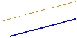
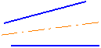
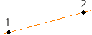
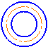
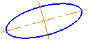
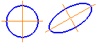
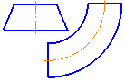
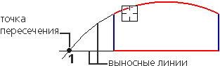
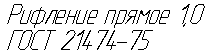

# Обозначения в эскизах

Добро пожаловать в урок "Обозначения в эскизах". В этом уроке мы рассмотрим несколько важных элементов, которые помогут сделать ваши эскизы более информативными и понятными.

## Автоосевая

**Автоосевая** — это осевая линия, автоматически создаваемая программой КОМПАС-3D. Она используется для обозначения центральной оси симметрии или центральной линии в эскизе.

| №   | Тип линии                                                       | Пример                                                                                  |
| --- | --------------------------------------------------------------- | --------------------------------------------------------------------------------------- |
| 1   | Осевая линия, параллельная или перпендикулярная отрезку         |          |
| 2   | Биссектриса угла, образованного двумя отрезками                 |                  |
| 3   | Осевая линия по двум точкам                                     |                                      |
| 4   | Дуговая осевая линия по двум концентрическим объектам           |            |
| 5   | Обозначение центра осесимметричного объекта                     |                      |
| 6   | Обозначения центра для нескольких объектов                      |                       |
| 7   | Осевая линия проекции грани, имеющей форму поверхности вращения |  |

## Условное пересечение

**Условное пересечение** представляет собой специальный знак, указывающий на точку, где линии или кривые пересекаются. Это облегчает восприятие геометрических отношений в эскизе.

## Надпись

**Надписи** используются для добавления текстовой информации к элементам эскиза. Они могут содержать размеры, значения, комментарии и другую полезную информацию.

## Заключение

В завершение этого урока мы рассмотрели важные элементы обозначений в эскизах, такие как автоосевая, условное пересечение и надписи. Эти инструменты придают структуру и ясность вашим эскизам, делая их более информативными.

В следующем уроке мы перейдем к рассмотрению команд и инструментов для изменения геометрии ваших эскизов. Вы узнаете, как редактировать, изменять формы и параметры, делая ваш дизайн более гибким и соответствующим вашим требованиям.
