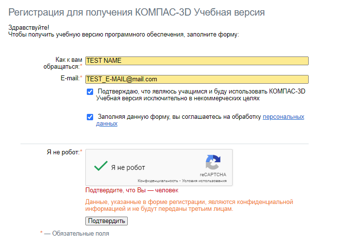
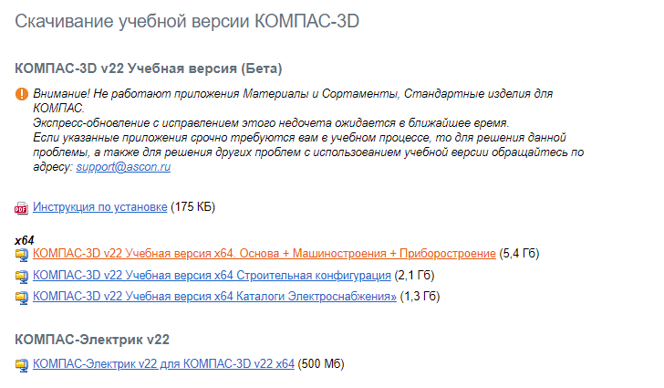

# Подготовка к установке

Перед тем как приступить к установке программы КОМПАС 3D, необходимо внимательно подготовиться. В этом уроке мы расскажем о всех этапах подготовки к установке, чтобы убедиться, что процесс пройдет гладко и успешно.

## Шаг 1: Проверка системных требований

Перед установкой удостоверьтесь, что ваш компьютер соответствует [минимальным и рекомендуемым системным требованиям](https://kompas.ru/kompas-educational/about/) для работы с КОМПАС 3D. Это обеспечит стабильную и эффективную работу программы.

**Минимальные системные требования:**

- Процессор с поддержкой инструкций SSE2 и AVX.
- Видеокарта с поддержкой OpenGL 2.0.
- Остальные параметры минимально возможной конфигурации компьютера для установки и запуска КОМПАС-3D определяются минимальными системными требованиями для соответствующих операционных систем.

**Рекомендуемые системные требования для комфортной работы:**

- Многоядерный процессор (4 ядра и больше) с тактовой частотой 3 ГГц и выше.
- 16 ГБ оперативной памяти и более.
- Видеокарта с поддержкой OpenGL 4.5, с 2 ГБ видеопамяти и более, пропускная способность видеопамяти — 80 ГБ/с и более.
  Монитор с разрешением 1920x1080 пикселов или более.

Удостоверьтесь, что ваш компьютер соответствует хотя бы минимальным системным требованиям, чтобы обеспечить корректную работу программы. Для комфортной работы рекомендуется использовать компьютер с параметрами, соответствующими рекомендуемым требованиям.

## Шаг 2: Загрузка установочного файла

1. Вам необходимо зарегистрироваться на [официальном сайте КОМПАС 3D](<(https://edu.ascon.ru/main/download/cab/)>), если вы еще этого не сделали. В качестве примера, представлен скриншот регистрационной формы.



2. После успешной регистрации, войдите в свой аккаунт на сайте.

3. В разделе загрузок найдите и выберите установочный файл `КОМПАС-3D v22 Учебная версия x64. Основа + Машиностроение + Приборостроение`. Для вашего удобства приведен пример скриншота данной страницы.



## Шаг 3: Подключение образа диска в PowerShell

Теперь, когда у вас есть установочный образ КОМПАС-3D, необходимо подключить его к виртуальному диску. Для этого выполните следующие действия:

1. Зайдите в PowerShell с правами администратора.
2. Используйте команду:

```powershell
Mount-DiskImage -ImagePath "[путь_к_вашему_виртуальному_диску]\KOMPAS-3D_v22_Study_x64.iso"
```

Эта команда поможет вашей операционной системе распознать образ диска и предоставить доступ к его содержимому.

```powershell
# Пример выполнения команды
PS C:\WINDOWS\system32> Mount-DiskImage -ImagePath "D:\Dowload\KOMPAS-3D_v22_Study_x64.iso"

Attached          : True
BlockSize         : 0
DevicePath        : \\.\CDROM0
FileSize          : 5833893888
ImagePath         : D:\Dowload\KOMPAS-3D_v22_Study_x64.iso
LogicalSectorSize : 2048
Number            : 0
Size              : 5833893888
StorageType       : 1
PSComputerName    :
```

Успешное выполнение команды будет подтверждено соответствующим сообщением в консоли. Если вы увидите сообщение о успешном подключении образа, значит, вы готовы перейти к установке КОМПАС-3D.
