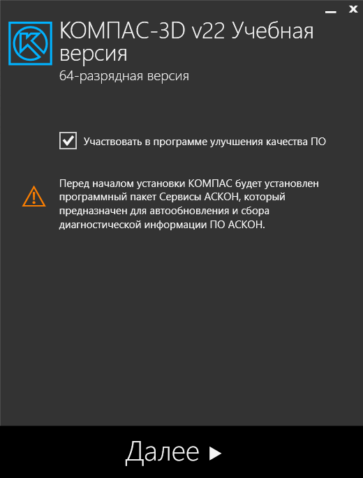
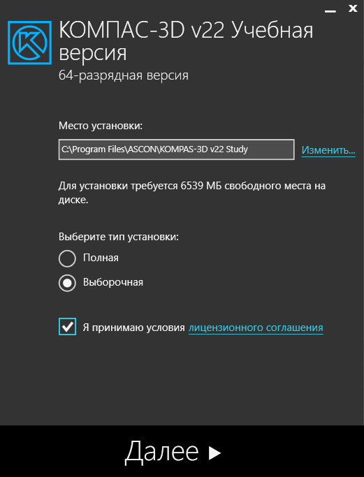
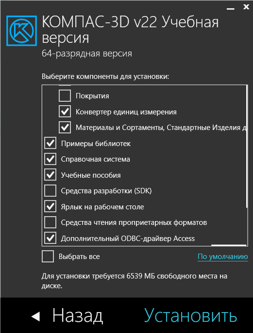

# Установка программы КОМПАС 3D

Теперь, когда мы убедились, что все необходимые файлы загружены и образ диска подключен, переходим к установке программы КОМПАС 3D.

## Шаг 1: Запуск установочного файла

1. Откройте виртуальный диск `KOMPAS-3D_v22_Study_x64` с помощью Проводника Windows.
2. В корне диска найдите и запустите файл `Setup.exe`.

## Шаг 2: Установка программного пакета `Сервисы АСКОН`

**Автообновление ПО АСКОН**: Позволяет автоматически обновлять программные продукты от компании АСКОН, в том числе и КОМПАС 3D. Это важно, так как обновления могут содержать улучшения, исправления ошибок и новые функции.

**Сбор диагностической информации**: Позволяет собирать диагностическую информацию о работе программ АСКОН. Это важно для анализа проблем и улучшения качества программного обеспечения.

**Важно отметить**, что установка программного пакета "Сервисы АСКОН" может оказать некоторое влияние на производительность системы. Обычно это незаметно для пользователей, но стоит учитывать, что программа будет работать в фоновом режиме, осуществляя автообновление и сбор диагностической информации.

## Шаг 3: Выбер места и типа установки

На этом этапе вам предлагается выбрать место для установки программы КОМПАС 3D. Рекомендуется оставить стандартный путь установки, но при необходимости вы можете выбрать другую директорию на вашем компьютере.

Также вам предоставляется выбор типа установки. Рекомендуется выбрать тип "Выборочная", чтобы иметь возможность выборочно установить необходимые компоненты. Это позволяет избежать установки ненужных дополнений и сохранить место на жестком диске.

## Шаг 4: Установка КОМПАС 3D

Чтобы начать загрузку необходимых файлов для работы КОМПАС 3D, просто нажмите кнопку `Установить`.

**Учтите**, что данная процедура может потребовать некоторого времени, поэтому это отличный момент для небольшого перерыва. Вы можете воспользоваться этим временем, например, чтобы приготовить чашечку чая или ознакомиться с более подробной информацией о сервисах АСКОН.
