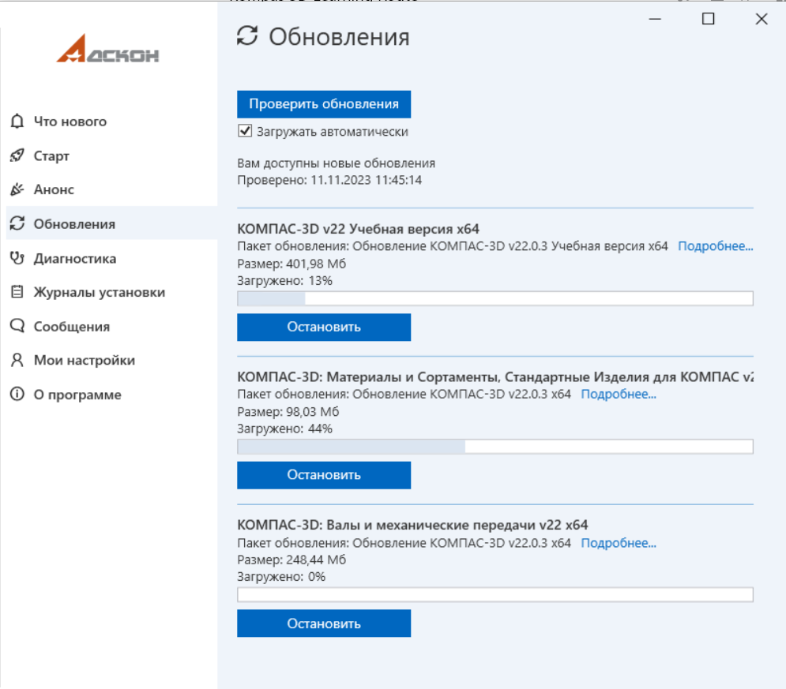

# Сервисы АСКОН

Программный пакет [Сервисы АСКОН](https://update.ascon.ru/) предназначен для двух основных целей: автоматического обновления программы и сбора диагностической информации. Давайте рассмотрим, как этот инструмент может быть полезен в вашей работе.

## Автообновление программы

Сервисы АСКОН включают в себя механизм автообновления, который следит за актуальностью вашей версии КОМПАС 3D. Когда появляется новая версия программы, пакет автоматически уведомляет вас и предлагает установить обновление. Это позволяет вам всегда использовать последнюю версию программы с улучшенными функциями и исправленными ошибками.

## Сбор диагностической информации

Сервисы АСКОН также собирают диагностическую информацию о работе программы. Эта информация анонимно передается на серверы АСКОН и помогает разработчикам выявлять и исправлять возможные проблемы, повышая стабильность и производительность программы. Важно отметить, что сбор диагностической информации абсолютно анонимен и не содержит конфиденциальных данных пользователя.

## Заключение

Пока мы занимались ознакомлением с Сервисами АСКОН и наслаждались чашечкой чая, пришло время проверить, успешно ли завершилась установка КОМПАС 3D.
