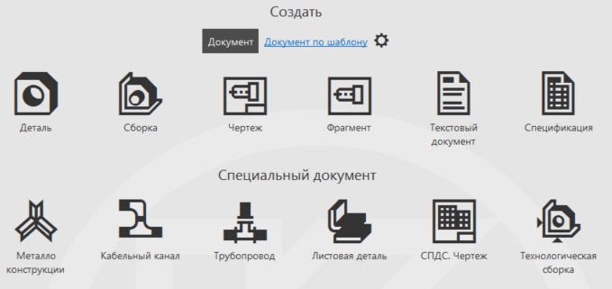
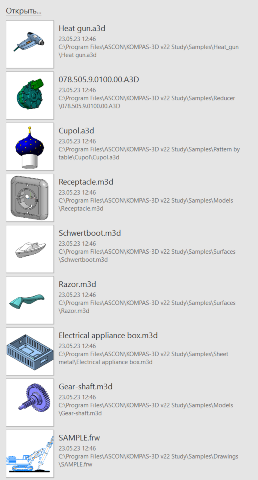
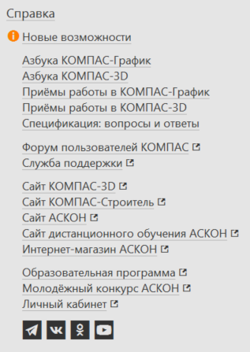

# Главное меню

Добро пожаловать в урок "Главное меню"! Здесь мы познакомимся с основными функциями, доступными через главное меню приложения КОМПАС 3D. Эти функции позволят вам управлять вашими проектами и выполнять ключевые операции.

## Создание проектов

На панели "Создать" вы можете установить основные параметры для нового проекта. Здесь вы можете указать название проекта, выбрать его местоположение на компьютере, а также задать другие параметры, необходимые для вашей работы.

В рамках данного курса мы начнем с создания деталей. Это позволит вам овладеть основами 3D-моделирования и научиться работать с различными инструментами КОМПАС 3D. Постепенно, с набором навыков, мы перейдем к созданию сборок, где вы сможете объединять детали в единое конструктивное целое.

**Не забывайте регулярно сохранять свои проекты**, чтобы избежать потери данных. Кроме того, в ходе создания проекта, будьте внимательны к выбору параметров, они могут повлиять на последующую работу.

## Открытие проектов

На панели "Открыть" вы найдете как образцы проектов, предоставленные АСКОН для ознакомления, так и свои собственные работы, которые вы создадите в ходе обучения. Если у вас уже есть готовый проект, воспользуйтесь функцией "Открыть...", указав путь к нему в проводнике.

## Справочная информация

На панели "Справка" вы найдете полезные ресурсы и информацию о программе КОМПАС 3D. Здесь доступны справочные материалы, руководства пользователя, а также онлайн-ресурсы и контактные данные поддержки. Если у вас возникли вопросы или нужна помощь, обратитесь к разделу "Справка".

