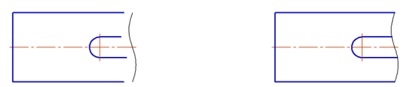
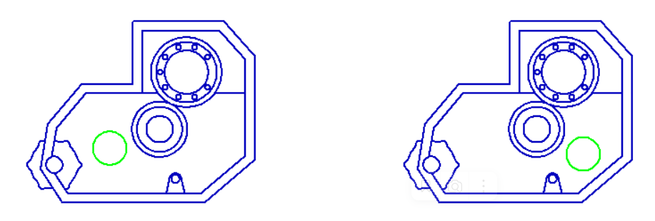
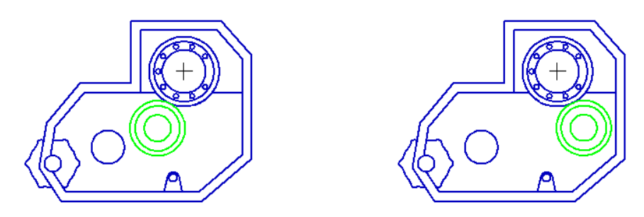
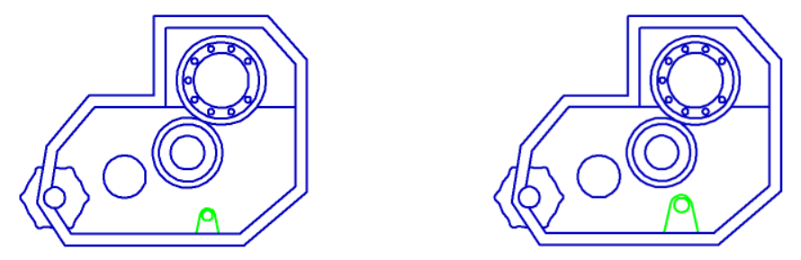

# Изменение геометрии в эскизах

Добро пожаловать в урок "Изменение геометрии в эскизах". На этом этапе мы рассмотрим основные команды и инструменты, которые позволят вам редактировать и изменять геометрические параметры ваших эскизов в программе КОМПАС 3D.

## Основные команды

### 1. Усечь кривую

Эта команда позволяет обрезать кривую до определенной точки или объекта. Вы выбираете кривую и указываете место обрезки.

### 2. Удленить до ближайшего объекта

Увеличивает длину кривой до ближайшего объекта. Это полезно, когда необходимо привязать конец кривой к другому объекту.

### 3. Переместить по координатам

Позволяет перемещать выбранные элементы эскиза вдоль координатных осей. Вы указываете величину смещения в направлении X, Y и Z.

### 4. Повернуть

Вращает выбранные элементы эскиза вокруг заданной точки. Вы выбираете элементы, указываете точку вращения и задаете угол поворота.

### 5. Зеркально отразить

Создает зеркальную копию выбранных элементов относительно заданной плоскости. Вы выбираете элементы, указываете плоскость отражения.

### 6. Копия по кривой

Эта команда в программе КОМПАС 3D предоставляет возможность создать копии выбранных элементов, вытянутых вдоль заданной кривой. Это мощный инструмент для создания повторяющихся или симметричных элементов вдоль сложных форм.

**Шаги использования:**

1. **Выбор кривой:** Укажите кривую, вдоль которой нужно создать копии. Это может быть линия, дуга или любая другая кривая в эскизе.
2. **Настройка параметров:** Задайте параметры копирования, такие как количество копий, расстояние между копиями и другие характеристики.

Эта команда особенно полезна при создании деталей, которые должны повторяться вдоль сложных форм, таких как витые кривые или изогнутые поверхности. Она упрощает процесс моделирования и позволяет быстро создавать детали с учетом сложной геометрии.

### 7. Копия по окружности

Эта команда в программе КОМПАС 3D предоставляет возможность создать копии выбранных элементов вокруг заданной окружности. Это полезный инструмент для создания повторяющихся элементов в круговой конфигурации.

**Шаги использования:**

1. **Выбор окружности:** Укажите окружность, вокруг которой нужно создать копии. Это может быть заранее созданная окружность или же вы можете создать новую на этапе использования команды.
2. **Настройка параметров:** Задайте параметры копирования, такие как количество копий, угловой интервал, расстояние между копиями и другие характеристики.

Эта команда удобна для создания радиально симметричных элементов, таких как лепестки, зубцы и другие детали, которые располагаются вокруг центральной точки. Она значительно ускоряет процесс моделирования и обеспечивает точное распределение элементов по окружности.

### 8. Копия по сетке

Команда "Копия по сетке" в программе КОМПАС 3D предоставляет удобный способ создания копий выбранных элементов вдоль двух направлений, образуя сетку.

**Настройка параметров сетки:** Задайте параметры сетки, такие как количество копий в каждом направлении, расстояние между копиями, угловой интервал и другие характеристики.

Эта команда полезна при создании решетчатых или сетчатых структур, а также при расположении элементов в виде матрицы. Она предоставляет удобный способ равномерного размещения элементов в пространстве и упрощает процесс моделирования.

### 9. Копия по концентрической сетке

Команда "Копия по концентрической сетке" в программе КОМПАС 3D позволяет создавать копии выбранных элементов, размещая их вдоль концентрических кругов.

**Настройка параметров сетки:** Задайте параметры концентрической сетки, такие как количество копий, радиусы кругов, угловой интервал и другие характеристики.

Эта команда полезна при создании элементов с радиальной симметрией, например, при моделировании деталей секторов или элементов, расположенных вокруг центральной точки. Она обеспечивает эффективный способ размещения элементов вдоль концентрических линий.

### 7. Повернуть

Еще одна команда поворота, которая позволяет вращать элементы эскиза. Выбираете элементы, указываете точку вращения и задаете угол поворота.

### 8. Масштабирование

Изменяет размеры выбранных элементов, сохраняя пропорции. Вы указываете коэффициент масштабирования.

## Заключение

В этом уроке мы рассмотрели основные команды изменения геометрии в эскизах. Однако, помните, что это всего лишь введение, и полный перечень команд предоставлен в [Азбуке КОМПАС](https://help.ascon.ru/KOMPAS/22/ru-RU/id_sketch_mode.html), где вы можете ознакомиться с более подробной информацией и примерами использования каждой команды. Уверены, что с опытом вы станете более уверенными в работе с этими инструментами, открывая новые возможности для воплощения ваших проектных идей.

На этом уроке мы изучили основные команды изменения геометрии в эскизах, что является важным этапом в создании деталей. Однако, чтобы наши проекты были точными и соответствовали заданным параметрам, необходимо также уметь задавать размеры.

В следующем уроке мы углубимся в процесс задания размеров, что позволит точно определить размеры и форму создаваемых деталей. Знание этого этапа работы важно для создания проектов высокого качества и точности. Приготовьтесь к новому этапу обучения, где мы подробно рассмотрим команды и методы задания размеров в эскизах программы КОМПАС 3D.
