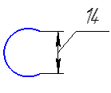
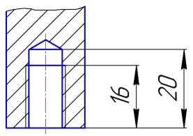
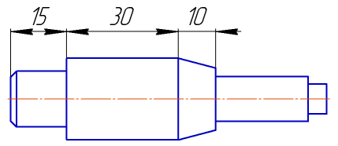
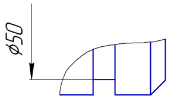
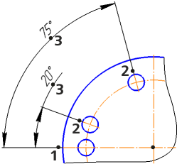
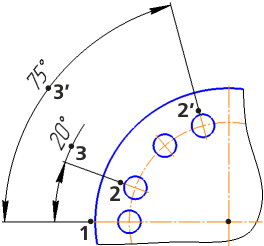
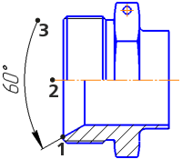
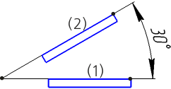
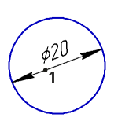

# Размеры в эскизах

Добро пожаловать в урок по работе с размерами в эскизах программы КОМПАС-3D. В этом уроке мы рассмотрим основные команды для простановки размеров, которые помогут вам точно определить размеры и пропорции вашей детали.

## 1. Авторазмеры

КОМПАС-3D обладает удобной функцией авторазмеров, которая автоматически определяет и проставляет размеры для элементов в эскизе. Это значительно упрощает процесс и ускоряет создание документации.

## 2. Линейные размеры

Команда линейного размера в программе КОМПАС-3D позволяет измерять длины отрезков, сторон прямоугольников и других линейных элементов. Для использования этой команды выберите соответствующую опцию, а затем укажите две точки или грани, к которым необходимо добавить размер.

| №   | Название опции                           | Описание                                                                                                                                                                                 | Пример                                                    |
| --- | ---------------------------------------- | ---------------------------------------------------------------------------------------------------------------------------------------------------------------------------------------- | --------------------------------------------------------- |
| 1   | Простой линейный размер                  | Используется для измерения расстояния между двумя точками на чертеже. Выберите эту опцию, затем укажите две точки, между которыми требуется установить размер.                           |                   |
| 2   | Линейный размер от общей базы            | "Линейный размер от общей базы" измеряет расстояние от общей базы (начальной точки) до выбранной точки. Это удобно, когда вам нужно определить расстояние от определенной базовой точки. |             |
| 3   | Цепной линейный размер                   | Создает последовательность линейных размеров между несколькими точками. Выбирайте эту опцию, чтобы измерить расстояние по цепочке от одной точки к другой.                               |                    |
| 4   | Линейный размер с общей размерной линией | Используется для измерения расстояний с использованием общей размерной линии. Это делает измерения более наглядными, особенно при работе с параллельными элементами.                     |  |
| 5   | Линейный размер от отрезка до точки      | Позволяет измерить расстояние от выбранного отрезка до указанной точки.                                                                                                                  |       |
| 6   | Линейный размер с обрывом                | Создает размер с обрывом, что полезно, когда элементы чертежа находятся близко друг к другу, и обозначение размера должно быть более наглядным.                                          |                 |

## 3. Угловые размеры

Для измерения углов между линиями или отрезками в программе КОМПАС-3D используйте команду углового размера. Просто укажите три точки, которые определяют угол, и размер будет автоматически вычислен.

| №   | Название опции                          | Описание                                                                                                                                              | Пример                                                   |
| --- | --------------------------------------- | ----------------------------------------------------------------------------------------------------------------------------------------------------- | -------------------------------------------------------- |
| 1   | Простой угловой размер                  | Позволяет измерить угол между двумя линиями. Выберите эту опцию, затем укажите три точки для определения угла.                                        |                   |
| 2   | Угловой размер от общей базы            | Измеряет угловое значение от общей базовой точки до указанной точки. Это удобно, когда важно определить угол относительно определенной базовой точки. |             |
| 3   | Цепной угловой размер                   | Создает последовательность угловых размеров между несколькими точками. Это полезно при измерении углов по цепочке от одной точки к другой.            |                    |
| 4   | Угловой размер с общей размерной линией | Используется для измерения углов с использованием общей размерной линии, что делает измерения более четкими.                                          |  |
| 5   | Угловой размер с обрывом                | Создает размер с обрывом, делая обозначение угла более наглядным.                                                                                     |                 |
| 6   | Указание сторон углов                   | Эта опция позволяет указать стороны угла, что может быть полезно при работе с сложными геометрическими формами.                                       |                    |

## 4. Радиальные и диаметральные размеры

Для кругов и окружностей в программе КОМПАС-3D используются радиальные и диаметральные размеры. Выберите соответствующую команду, затем укажите круг или окружность. Диаметральные размеры измеряют диаметр, а радиальные - расстояние от центра до края.

| №   | Название размерной опции                   | Описание                                                                                                     | Пример                                                       |
| --- | ------------------------------------------ | ------------------------------------------------------------------------------------------------------------ | ------------------------------------------------------------ |
| 1   | Диаметральный размер                       | Используется для измерения диаметра круга или окружности. Выберите эту команду, затем укажите нужный объект. |                         |
| 2   | Простой радиальный размер                  | Позволяет измерить расстояние от центра круга или окружности до выбранной точки на его крае.                 |                    |
| 3   | Радиальный размер на полке с ответвлениями | Используется для измерения радиуса круга, проходящего по полке с ответвлениями.                              |  |
| 4   | Радиальный размер с изломом                | Позволяет измерить расстояние от центра круга или окружности до точки с изломом на его крае.                 |                 |

## Заключение

Мы представили вам основные команды измерения и их опции, но это лишь введение в функционал программы. Для более глубокого понимания и использования всех возможностей рекомендуем обратиться к [Азбуке КОМПАС](https://help.ascon.ru/KOMPAS/22/ru-RU/bp1945948.html), где представлена подробная информация о каждой команде, её применении и возможностях.

В этом уроке мы рассмотрели основные команды простановки размеров в эскизах программы КОМПАС-3D. Размеры играют важную роль в точном определении параметров вашей детали, делая ее соответствующей заданным требованиям. Однако, использование размеров не ограничивается только статическими значениями.

В следующем уроке мы узнаем, как использовать размеры для динамического изменения эскиза с помощью таблицы переменных. Это мощный инструмент, который позволяет легко и гибко управлять параметрами эскиза, делая процесс проектирования более эффективным и удобным.
