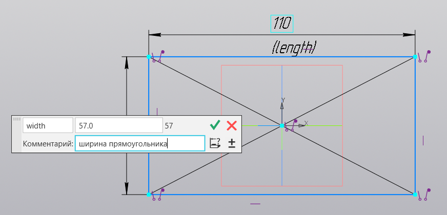

# Переменные в эскизах

Добро пожаловать в урок о переменных в эскизах программы КОМПАС 3D. Переменные предоставляют удобный способ управления размерами и параметрами вашего эскиза. Давайте рассмотрим, как использовать переменные для более гибкого и удобного управления вашими проектами.

## Задание имени переменной

При простановке размеров вы можете задать имя переменной, которая будет ассоциирована с данным размером. Это позволяет легко идентифицировать размеры и привязывать их к определенным параметрам вашего проекта.

## Таблица переменных

Переменные автоматически отображаются в таблице переменных, которая предоставляет обзор всех переменных, используемых в эскизе. Здесь вы можете видеть их значения, а также изменять их напрямую в таблице.

Важной возможностью программы КОМПАС 3D является использование функции "Вставить функцию", которая позволяет вам создавать математические связи между переменными, а также использовать различные математические константы и функции. Это мощный инструмент для оптимизации и управления вашими параметрами.

## Динамическое изменение эскиза

Используя таблицу переменных, вы можете динамически изменять размеры и параметры эскиза. Просто измените значение переменной в таблице, и эскиз будет автоматически перестроен в соответствии с новыми параметрами.

## Заключение

В данном уроке мы изучили важные аспекты работы с размерами в программе КОМПАС 3D. От простых линейных размеров до угловых и радиальных — каждый тип размера играет ключевую роль в определении геометрических параметров деталей.

Мы также рассмотрели возможность использования переменных и функции "Вставить функцию" для создания математических связей между параметрами, что дает больше гибкости и контроля над вашим проектом.

В следующем уроке мы погрузимся в тему ограничений в эскизах. Ограничения помогают нам точно определить положение и форму элементов детали. Мы рассмотрим различные виды ограничений и научимся использовать их для создания стабильных и точных эскизов.
