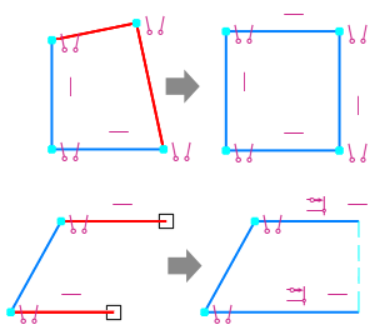
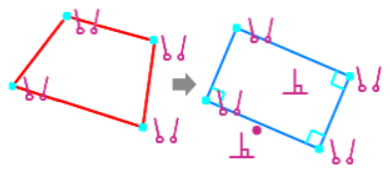
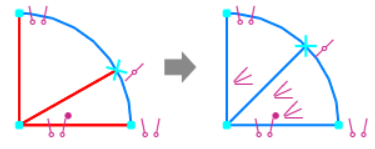
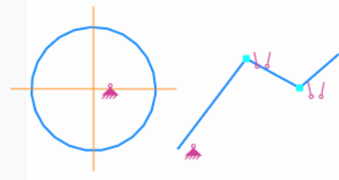
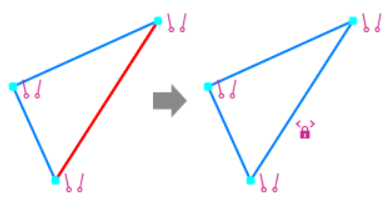
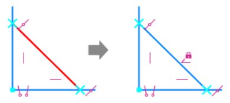
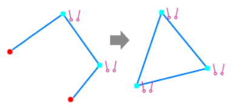

# Ограничения в эскизах

Добро пожаловать в урок ограничений в эскизах программы КОМПАС-3D. Ограничения играют важную роль в создании стабильных и точных эскизов, позволяя определить положение и форму элементов детали. Давайте рассмотрим основные команды ограничений.

| №   | Ограничение              | Описание                                                                                                                                                                       | Пример                                     |
| --- | ------------------------ | ------------------------------------------------------------------------------------------------------------------------------------------------------------------------------ | ------------------------------------------ |
| 1   | Выравнивание             | Это ограничение позволяет выровнять объекты по горизонтали или вертикали. Выберите элементы, которые вы хотите выровнять, и задайте горизонтальное или вертикальное положение. |              |
| 2   | Параллельность           | Ограничение, которое делает две линии или поверхности параллельными. Это полезно для создания симметричных элементов.                                                          |            |
| 3   | Перпендикулярность       | Создает перпендикулярное положение между двумя линиями или поверхностями, обеспечивая прямоугольные соединения.                                                                |        |
| 4   | Касание                  | Ограничение, фиксирующее точечное касание между кривыми. Это позволяет создавать гладкие переходы.                                                                             |                   |
| 5   | Коллинеарность           | Соединяет две линии в одну прямую, обеспечивая их коллинеарность.                                                                                                              |            |
| 6   | Биссектриса              | Ограничение, которое создает биссектрису угла между двумя линиями или отрезками.                                                                                               |               |
| 7   | Фиксация точки           | Фиксирует положение точки в пространстве, предотвращая ее перемещение.                                                                                                         |            |
| 8   | Фиксация длины           | Ограничивает длину линии или отрезка, устанавливая точные размеры.                                                                                                             |            |
| 9   | Фиксация угла            | Устанавливает точное значение угла между линиями или отрезками.                                                                                                                |             |
| 10  | Концентричность          | Связывает два объекта, делая их концентричными, например, окружность с центром в центре другой окружности.                                                                     |           |
| 11  | Объединение точек        | Объединяет две точки в одну, устраняя избыточные элементы.                                                                                                                     |         |
| 12  | Равенство                | Делает две линии или отрезка равными по длине, обеспечивая симметричные формы.                                                                                                 |                 |
| 13  | Точка на середине кривой | Фиксирует точку точно посередине выбранной кривой.                                                                                                                             |  |

## Заключение

Мы рассмотрели основы интерфейса, создания эскизов, применения размеров и ограничений. Теперь пришло время применить полученные знания на практике.

В следующем этапе наших уроков мы перейдем к практическим заданиям, где вы сможете применить все изученные навыки. Также мы подготовимся к контрольному мероприятию, которое поможет закрепить полученные знания.
