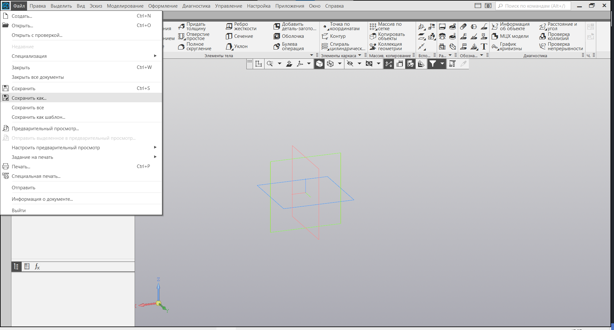
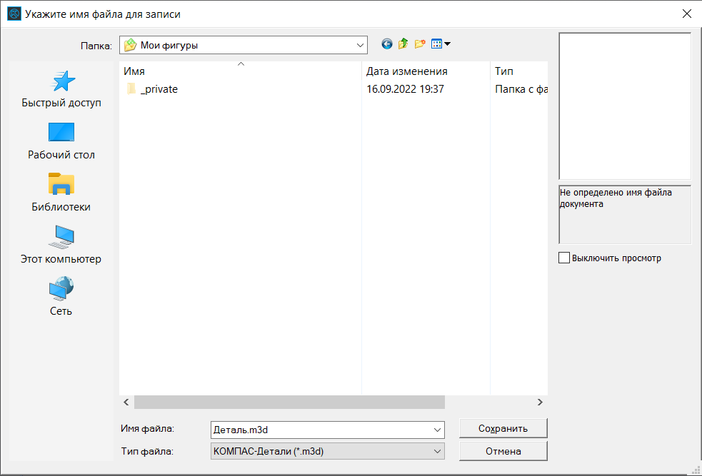

# Создание Детали. Создание проекта

Добро пожаловать в урок "Создание детали. Создание проекта". На этом этапе мы погрузимся в процесс создания проекта и начнем изучение интерфейса КОМПАС 3D.

Вы, вероятно, заметили, что уроки по созданию проекта детали и работе с интерфейсом были включены в главу "Эскизы". Это решение не случайно. Интерфейс КОМПАС 3D обширен, и без понимания его основ, особенно в контексте работы с деталями, можно легко запутаться и не найти необходимые инструменты для создания эскизов.

В главе по созданию деталей мы вернемся к интерфейсу работы с деталями и рассмотрим его более подробно. На данном этапе, пожалуйста, примите информацию так, что определенные панели инструментов и элементы интерфейса необходимы для успешного выполнения задач. Начнем урок!

## Создание нового проекта

Для того чтобы начать новый проект в КОМПАС 3D, следуйте простым шагам:

1. Откройте главное меню.
2. В панели "Создать" выберите опцию "Деталь".

После выполнения этих шагов автоматически будет создан новый проект, и вы будете готовы приступить к работе. Не забудьте сохранить проект, придумав ему уникальное название.

## Сохранение проекта

Чтобы сохранить ваш проект в КОМПАС 3D, выполните следующие шаги:

1. Находясь в верхней части программы, выберите вкладку "Файл".
2. В выпадающем меню выберите опцию "Сохранить как".

После этого откроется окно сохранения, где вы сможете выбрать место на вашем компьютере, указать название проекта и выбрать необходимый формат сохранения. После завершения этих шагов ваш проект будет сохранен, и вы сможете в любое время продолжить работу с ним.

Мы надеемся, что этот урок о создании нового проекта и сохранении вас не только ознакомил, но и вдохновил начать свой путь в мире 3D-моделирования с КОМПАС 3D. Создание проекта - первый шаг, который открывает двери к бескрайним возможностям.

## Заключение

В следующем уроке мы глубже погрузимся в интерфейс КОМПАС 3D. Узнаем, как использовать различные панели инструментов, работать с параметрами детали и многое другое. Это знание станет основой для более сложных и захватывающих проектов. Приготовьтесь к новым открытиям и берите в руки мышь – следующий урок будет увлекательным!
