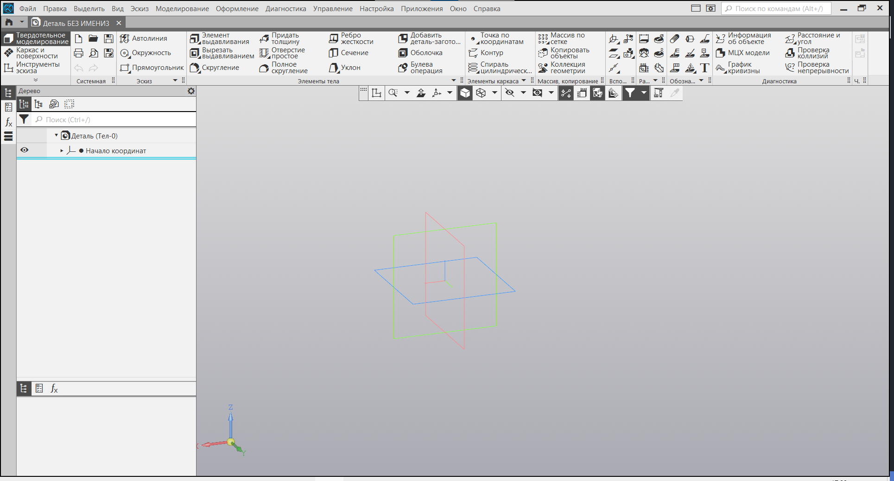
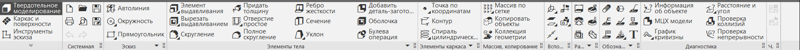
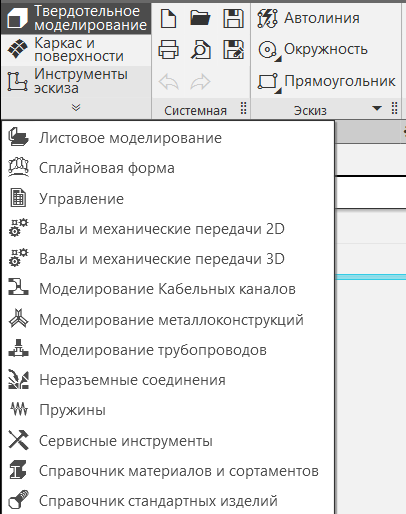
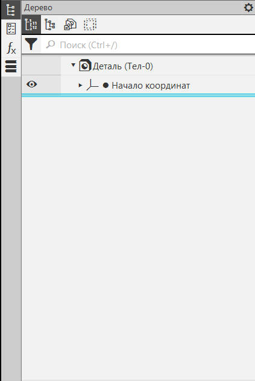
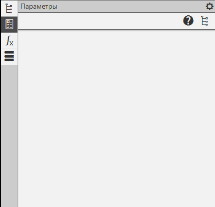
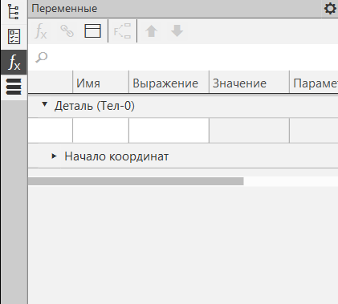
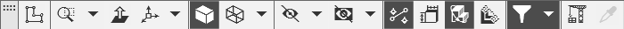
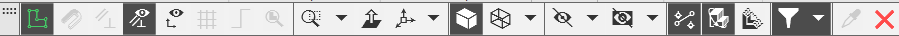

# Создание детали. Интерфейс

Добро пожаловать в урок "Создание детали. Интерфейс"! В этом уроке мы подробно рассмотрим ключевые элементы интерфейса, специфичные для создания деталей в программе КОМПАС 3D.

## Панель инструментов

Панель инструментов в контексте создания детали предоставляет доступ к инструментам, специализированным для работы с деталями. Здесь вы найдете команды для создания базовых форм, вырезов, построения ребер и другие инструменты, необходимые для создания деталей.

Важным элементом панели инструментов является возможность переключения между различными наборами инструментов. Например, существует специальная панель инструментов для работы с эскизами. При необходимости создания эскиза вы можете легко переключиться на соответствующую панель и получить доступ к инструментам, специализированным для создания эскизов. Это обеспечивает удобство и эффективность в процессе моделирования деталей.

## Рабочая область

Главная рабочая область представляет собой центральное графическое окно, где вы будете создавать и редактировать детали. Здесь отображается ваша деталь, и здесь вы проводите основную часть работы по моделированию.

## Дерево детали

Слева находится дерево детали, которое отображает структуру вашей детали. Здесь вы увидите список всех элементов, входящих в состав детали, таких как вырезы, повороты, фаски и другие. Дерево детали обеспечивает удобный способ управления и структурирования элементов вашего проекта.

## Параметры детали

Стандартные панели, такие как панель свойств, предоставляют доступ к параметрам и настройкам вашей детали. Здесь вы можете установить размеры, материал, цвет и другие характеристики, определяющие внешний вид и поведение детали.

## Переменные детали

В некоторых случаях, для более гибкого и параметризованного моделирования, используются переменные. Это параметры, которые могут быть связаны с размерами или другими характеристиками детали. Переменные обеспечивают возможность легко изменять параметры детали, что особенно полезно при создании различных вариантов одной и той же детали.

## Панель вида

Панель Вида предоставляет инструменты для управления отображением вашей детали в рабочей области. Здесь вы можете изменять масштаб, управлять видимостью элементов и выбирать различные режимы отображения, что сделает вашу работу более удобной.

На панели Вида также расположена быстрая команда для создания эскиза. Это удобное средство позволяет мгновенно перейти к режиму создания эскиза, необходимого для начала моделирования детали. Просто нажмите на соответствующую кнопку на панели Вида, и вы сразу окажетесь в режиме работы с эскизом. Это удобно и экономит время, делая процесс создания детали более эффективным.

## Заключение

На этом этапе вы успешно освоили основы интерфейса для работы с деталями в КОМПАС 3D. Вы уже знакомы с основными элементами, такими как панели инструментов, дерево детали, параметры и переменные. Кроме того, вы заметили кнопки, предоставляющие доступ к инструментам для работы с эскизами.

В следующем уроке мы углубимся в интерфейс для работы с эскизами, рассмотрим дополнительные инструменты и техники, которые помогут вам более эффективно создавать 3D-модели. Готовьтесь к новым знаниям и практике – перед вами увлекательный путь в мире трехмерного моделирования!
