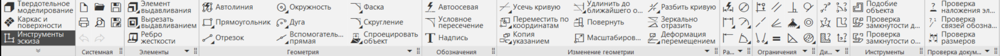
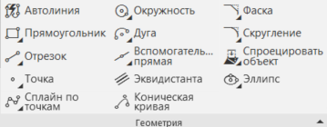
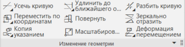
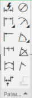
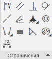

# Инструменты эскиза

Добро пожаловать в урок "Инструменты эскиза". В этом уроке мы более подробно рассмотрим основные инструменты, предоставляемые программой КОМПАС 3D для работы с эскизами.

## Геометрия

Блок "Геометрия" предоставляет базовые инструменты, необходимые для создания основных форм в эскизе. Он является отправной точкой при создании сложных 3D-моделей, обеспечивая удобство и эффективность в процессе проектирования.

## Обозначения

Блок "Обозначения" является важным инструментом для создания информативных и наглядных эскизов. Он обеспечивает возможность дополнительного объяснения и визуального улучшения каждого элемента, что может быть критически важно при работе с проектами различной сложности.

## Изменение геометрии

Блок "Изменение геометрии" является ключевым элементом для тщательной настройки и редактирования вашего эскиза. Эти инструменты обеспечивают гибкость и контроль, необходимые для достижения точных параметров и формы элементов.

## Размеры

Блок "Размеры" является ключевым инструментом для обеспечения точности и соответствия вашего эскиза проектным требованиям. Эти инструменты обеспечивают гибкость и контроль, необходимые для создания эскизов с необходимыми размерами и пропорциями.

## Ограничения

Блок "Ограничения" играет важную роль в обеспечении стабильности, точности и согласованности вашего эскиза. Эти инструменты дают вам контроль над взаимодействием элементов, что важно при создании сложных конструкций.

## Заключение

Мы ознакомились с основными инструментами эскиза в КОМПАС 3D, которые предоставляют широкие возможности для формирования разнообразных геометрических элементов. Геометрия, обозначения, изменение геометрии, размеры и ограничения — каждый из этих блоков играет важную роль в процессе проектирования. В будущих уроках мы более подробно изучим каждый из этих элементов.

На следующем этапе нашего обучения мы сосредоточим внимание на ключевом аспекте проектирования - эскизных плоскостях.
