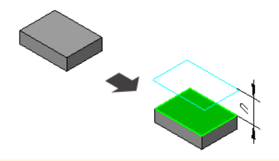
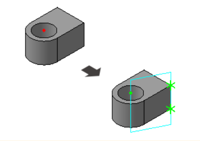
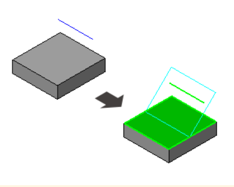
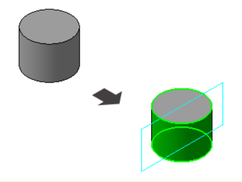

# Эскизная плоскость

Добро пожаловать в урок "Эскизные плоскости"! В этом уроке мы рассмотрим основные методы создания плоскостей для последующего построения эскизов в программе КОМПАС 3D.

**Эскизная плоскость** - это поверхность, на которой создается эскиз в программе КОМПАС 3D. Выбор правильной плоскости влияет на ориентацию и форму будущего объекта. Давайте рассмотрим различные методы построения эскизных плоскостей.

## Основные методы построения

| №   | Способы построения        | Описание построения                                                                                            | Пример                                     |
| --- | ------------------------- | -------------------------------------------------------------------------------------------------------------- | ------------------------------------------ |
| 1   | Смещенная плоскость       | Создание плоскости смещения позволяет вам задать расстояние и направление относительно существующей плоскости. |        |
| 2   | Плоскость через три точки | Определите плоскость, проходящую через три заданные точки в 3D-пространстве.                                   |  |
| 3   | Плоскость под углом       | Создайте плоскость, наклоненную под углом относительно существующей плоскости.                                 |        |
| 4   | Нормальная плоскость      | Определите плоскость, перпендикулярную к поверхности объекта в определенной точке.                             |       |

### Практическое применение

Эти методы являются основой для создания эскизов в КОМПАС 3D. Практикуйтесь в использовании различных способов создания эскизных плоскостей, чтобы лучше понимать их возможности и применение в реальных проектах.

## Заключение

**Примечание**: В данном уроке мы рассмотрели лишь основные методы. Существуют и другие способы создания эскизных плоскостей, которые вы можете изучить в [документации "Азбука КОМПАС"](https://help.ascon.ru/KOMPAS/22/ru-RU/postroenie_ploskostey.html).

В этом уроке мы изучили основные методы создания эскизных плоскостей в КОМПАС 3D. Эти методы предоставляют нам мощные инструменты для точного и гибкого моделирования различных форм и объектов. В следующем уроке мы применим полученные знания и создадим свой первый эскиз.
