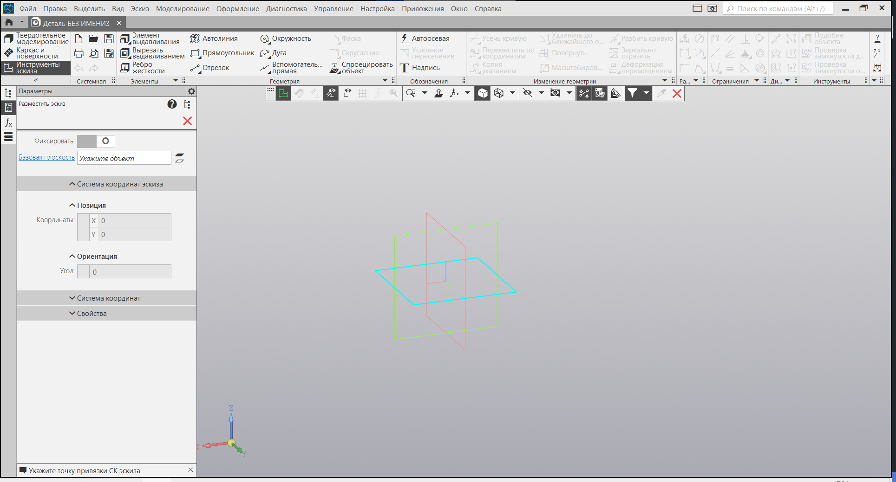
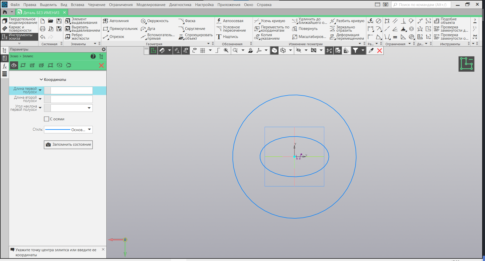
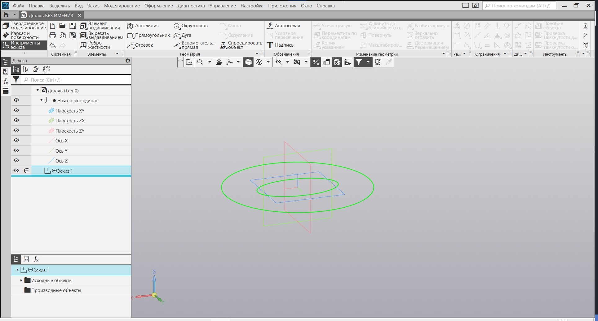
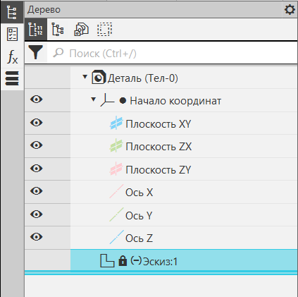

# Создание эскиза

Добро пожаловать в урок "Создание эскиза". В этом уроке мы научимся применять полученные знания о плоскостях и инструментах для создания своего первого эскиза в программе КОМПАС 3D.

## Шаг 1: Активация режима построения эскиза

На панели вида найдите опцию для активации режима построения эскиза.

## Шаг 2: Выбор плоскости

Теперь выберите плоскость, на которой вы хотите создать свой эскиз. Это может быть ортогональная плоскость, грань вашей детали или созданная вами плоскость с использованием функции "Построить плоскость". Этот выбор зависит от вашего проекта и того, где вы хотите разместить свой эскиз.

## Шаг 3: Отрисовка эскиза

Теперь вы в режиме построения эскиза на выбранной плоскости. Используйте доступные инструменты для рисования необходимых элементов. Вы можете добавлять линии, окружности, прямоугольники и другие геометрические формы. Это основные шаги для создания визуального представления вашей детали.

## Шаг 4: Завершение эскиза

После того как все необходимые элементы нарисованы и эскиз готов, завершите процесс.

## Восстановление эскиза после закрытия

Иногда случается так, что вы закрыли эскиз, не закончив его, и возникает вопрос: "Что делать?" Не переживайте, у вас есть возможность легко вернуться к редактированию.

1. **Откройте "Дерево Проекта"**: воспользуйтесь панелью "Дерево проекта" или аналогичной функцией в вашем программном обеспечении.
2. **Найдите Эскиз**: в дереве проекта вы увидите иерархию созданных вами элементов. Найдите раздел, который относится к вашему эскизу.
3. **Двойной Клик**: сделайте двойной клик по названию эскиза. Это приведет вас обратно к режиму редактирования эскиза, где вы сможете продолжить работу с уже созданными элементами или добавить новые.

Этот простой процесс позволяет вам вернуться к эскизу в любое время, даже если вы закрыли его раньше. Это удобно при долгосрочных проектах, когда требуется внесение изменений или добавление дополнительных деталей в созданный эскиз.

## Заключение

На следующем уроке мы более подробно рассмотрим основные команды для создания различных геометрических элементов в эскизах. Вы узнаете, как использовать линии, окружности, прямоугольники и другие инструменты для точного и эффективного построения геометрии.
