# Геометрия в эскизах

Добро пожаловать в урок "Геометрия в эскизах". На этом этапе мы рассмотрим основные команды для создания различных геометрических элементов в эскизах программы КОМПАС 3D. Готовы начать?

## Основные команды

### 1. Отрезок

Команда "Отрезок" используется для создания прямых линий. Это базовый элемент, который часто служит основой для более сложных форм.

| №   | Способы построения                      | Описание построения                                                                         | Пример                                                   |
| --- | --------------------------------------- | ------------------------------------------------------------------------------------------- | -------------------------------------------------------- |
| 1   | Отрезок через две точки                 | Создание отрезка, соединяющего две выбранные точки                                          | 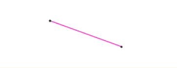                |
| 2   | Параллельный отрезок                    | Построение отрезка, параллельного выбранному отрезку                                        | 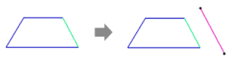                    |
| 3   | Перпендикулярный отрезок                | Формирование отрезка, перпендикулярного выбранному отрезку                                  | 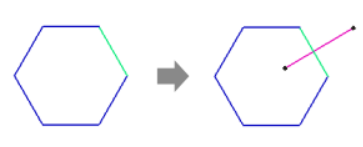                |
| 4   | Касательный отрезок через внешнюю точку | Построение отрезка, представляющего касательную линию к кривой или дуге через внешнюю точку | 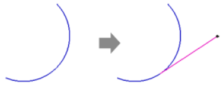 |
| 5   | Касательный отрезок через точку кривой  | Формирование отрезка, представляющего касательную линию к кривой через указанную точку      | 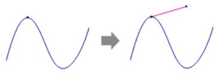  |
| 6   | Отрезок, касательный к двум кривым      | Построение отрезка, являющегося касательной к двум выбранным кривым                         |       |

### 2. Вспомогательная прямая

Вспомогательные прямые не влияют на геометрию модели и используются для создания вспомогательных линий, не входящих в конечный результат.

| №   | Способы построения                     | Описание построения                                                                     | Пример                                                  |
| --- | -------------------------------------- | --------------------------------------------------------------------------------------- | ------------------------------------------------------- |
| 1   | Прямая через две точки                 | Создание прямой, соединяющей две выбранные точки                                        | 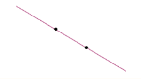                 |
| 2   | Горизонтальная прямая                  | Построение горизонтальной прямой, параллельной оси X                                    |                                                         |
| 3   | Вертикальная прямая                    | Формирование вертикальной прямой, параллельной оси Y                                    |                                                         |
| 4   | Параллельная прямая                    | Созание прямой, параллельной выбранной прямой                                           | 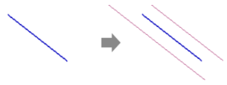                    |
| 5   | Перпендикулярная прямая                | Построение прямой, перпендикулярной выбранной прямой                                    | 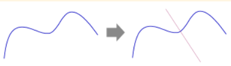                |
| 6   | Касательная прямая через внешнюю точку | Создание прямой, представляющей собой касательную к кривой или дуге через внешнюю точку | 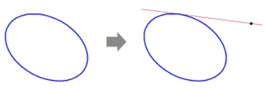 |
| 7   | Касательная прямая через точку кривой  | Формирование прямой, являющейся касательной к кривой через указанную точку              | 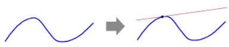  |
| 8   | Прямая, касательная к двум кривым      | Построение прямой, являющейся касательной к двум выбранным кривым                       | 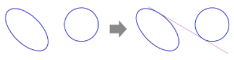      |
| 9   | Биссектриса                            | Формирование биссектрисы угла между двумя отрезками или линиями                         | 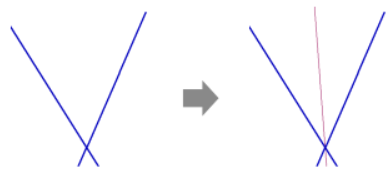                            |

Способы построения:

### 3. Окружность

Команда "Окружность" предоставляет возможность создания кругов и дуг. Эти элементы полезны при формировании кривых и закруглений.

| №   | Способы построения                    | Описание построения                                                               | Пример                                                 |
| --- | ------------------------------------- | --------------------------------------------------------------------------------- | ------------------------------------------------------ |
| 1   | Окружность по центру и точке          | Строится окружность, заданная центром и одной точкой на ней                       | 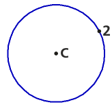          |
| 2   | Окружность по трем точкам             | Определяется окружность, проходящая через три указанные точки                     | 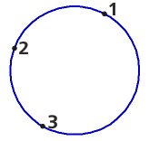             |
| 3   | Окружность с центром на объекте       | Создается окружность с центром, привязанным к объекту (например, к концу отрезка) | 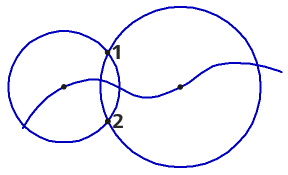       |
| 4   | Окружность, касательная к кривой      | Формируется окружность, касающаяся выбранной кривой                               |       |
| 5   | Окружность, касательная к двум кривым | Строится окружность, касающаяся двух выбранных кривых                             |  |
| 6   | Окружность, касательная к трем кривым | Создается окружность, касающаяся трех выбранных кривых                            |  |
| 7   | Окружность по двум точкам             | Формируется окружность, определенная двумя указанными точками                     |              |

### 4. Дуга

Дуги добавляют кривизну к вашему эскизу. Команда "Дуга" полезна при создании закруглений или декоративных элементов.

| №   | Способы построения                  | Описание построения                                                 | Пример                                               |
| --- | ----------------------------------- | ------------------------------------------------------------------- | ---------------------------------------------------- |
| 1   | Дуга по центру и двум точкам        | Строится дуга, заданная центром и двумя точками на ней              | 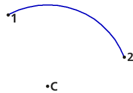        |
| 2   | Дуга по трем точкам                 | Определяется дуга, проходящая через три указанные точки             |                  |
| 3   | Дуга, касательная к кривой          | Создается дуга, касающаяся выбранной кривой                         | 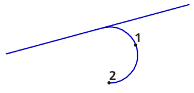          |
| 4   | Дуга по двум точкам                 | Формируется дуга, определенная двумя указанными точками             |                  |
| 5   | Дуга по двум точкам и углу раствора | Строится дуга, проходящая через две точки с заданным углом раствора |  |

### 5. Прямоугольник и многоугольник

Команды "Прямоугольник" и "Многоугольник" позволяют создавать соответственно прямоугольники и многоугольники, формируя основы для более сложных элементов.

| №   | Способы построения                    | Описание построения                                                                                                        | Пример                                                 |
| --- | ------------------------------------- | -------------------------------------------------------------------------------------------------------------------------- | ------------------------------------------------------ |
| 1   | Прямоугольник по двум вершинам        | Строится прямоугольник, определенный двумя противоположными вершинами                                                      | 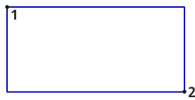        |
| 2   | Прямоугольник по центру и вершине     | Формируется прямоугольник, центр которого совпадает с указанной точкой, а одна из вершин задается пользователем            | 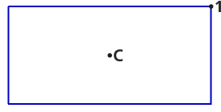     |
| 3   | Прямоугольник по трем вершинам        | Определяется прямоугольник, проходящий через три заданные вершины                                                          |         |
| 4   | Прямоугольник по центру и двум точкам | Создается прямоугольник, центр которого совпадает с указанной точкой, а две противоположные вершины задаются пользователем |  |

**Построение многоугольников**: формируется многоугольник, по заданному количеству вершин и вписанной или описанной окружности.

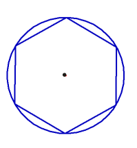

### 6. Эллипс

Команда "Эллипс" используется для создания эллипсов с заданными параметрами. Это полезно при формировании эллиптических форм.

| №   | Способы построения                                           | Описание построения                                                                                    | Пример                                                                        |
| --- | ------------------------------------------------------------ | ------------------------------------------------------------------------------------------------------ | ----------------------------------------------------------------------------- |
| 1   | Эллипс по центру и двум точкам                               | Создание эллипса, определенного центром и двумя выбранными точками на его границе                      | 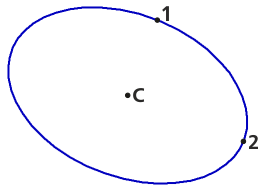                               |
| 2   | Эллипс по диагонали прямоугольника                           | Формирование эллипса, вписанного в прямоугольник, с использованием диагонали                           |                            |
| 3   | Эллипс по центру и вершине габаритного прямоугольника        | Построение эллипса, ограниченного габаритным прямоугольником, с центром и вершиной                     | 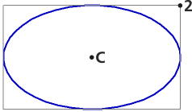        |
| 4   | Эллипс по центру, середине стороны и вершине параллелограмма | Создание эллипса, который вписан в параллелограмм, используя центр, середину одной из сторон и вершину |  |
| 5   | Эллипс по трем вершинам параллелограмма                      | Формирование эллипса, который ограничен тремя вершинами параллелограмма                                |                       |
| 6   | Эллипс по центру и трем точкам                               | Построение эллипса, определенного центром и тремя выбранными точками на его границе                    |                                |
| 7   | Эллипс, касательный к двум кривым                            | Формирование эллипса, который касается двух выбранных кривых                                           | 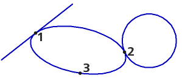                            |

### 7. Автолиния

Автолиния представляет собой особый элемент в программе КОМПАС 3D, который автоматически строится при работе с эскизами. Эта функциональность облегчает создание и редактирование геометрии, особенно в случаях, когда необходимо провести линию через определенную точку или по направлению к другому элементу эскиза.

## Заключение

Это лишь краткое введение в основные команды геометрии в эскизах. Для более подробного изучения рекомендуется ознакомиться с [Азбукой КОМПАС](https://help.ascon.ru/KOMPAS/22/ru-RU/ca1603773.html), где представлена полная информация о всех доступных командах и их применении.

В заключение этого урока мы освоили основные команды для создания геометрических элементов в эскизах. Теперь у вас есть навыки для построения отрезков, окружностей, дуг, прямоугольников, многоугольников и эллипсов. В следующем уроке мы погрузимся в обозначения. Приготовьтесь к новому этапу изучения КОМПАС 3D!
