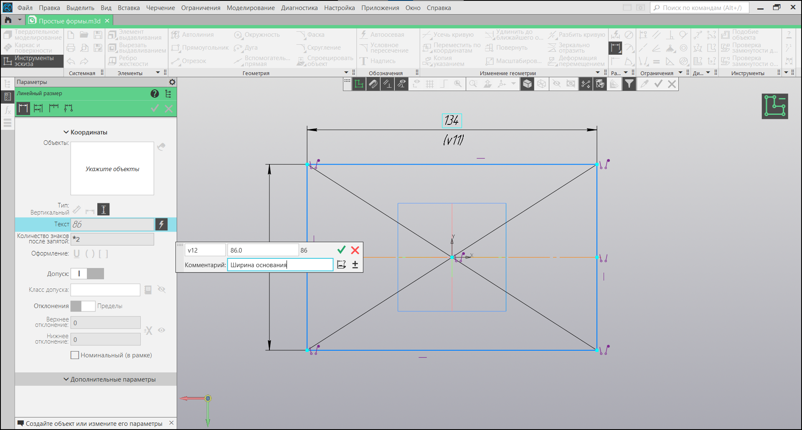

# Простые формы

В этом уроке мы рассмотрим, как построить простой эскиз, включающий разнообразные геометрические элементы. Этот урок предоставит вам базовые знания для создания элементарных эскизов в программе КОМПАС-3D.

## Задание

Постройте вид сверху, включающий в себя различные геометрические элементы.

## Решение

### Создание эскиза

1. Создайте эскиз в ортогональной плоскости XY.

### Основание детали

2. Используя команду "Прямоугольник", создайте основание детали.

3. Объедините центр основания с центром координат через команду "Объединить точки". Сначала выберите центр основания, затем центр координат.

4. Добавьте осевую линию вдоль основания, используя "Автоосевую".

5. Поставьте линейные размеры для основания с помощью "Линейного размера". Для удобства, используйте типы "горизонтальный" и "вертикальный," а также комментарии и задайте собственные имена переменным (латинскими буквами).

### Вырез в основании

6. Создайте окружность и касательный отрезок к ней, образуя вырез. Поставьте галочку "С осями" для отображения осевых линий.

7. Удалите лишнюю часть окружности и грани основания с помощью команды "Усечь кривую".

8. Задайте размеры для выреза, включая радиус окружности и глубину выреза.

### Выступ детали

9. Используя "Прямоугольник", отрисуйте выступ.

10. Создайте отверстие в выступе через "Прямоугольник по центру и вершине".

11. Объедините центр выступа с осевой линией, предварительно задав перпендикулярность с помощью "Перпендикулярности".

12. Задайте размеры выступа и отступ от левого края.

### Реальные размеры через таблицу параметров

13. Задайте реальные размеры эскиза с использованием таблицы параметров.

14. Для удобства, переразместите размеры для более понятного восприятия.

## Заключение

Это практическое занятие охватывает основные шаги создания простого эскиза. Экспериментируйте и практикуйтесь с инструментами, чтобы улучшить навыки по созданию базовых форм. В следующих уроках мы рассмотрим более сложные аспекты работы с эскизами.
