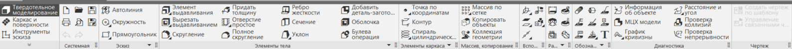
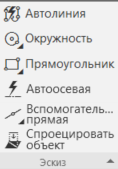
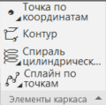
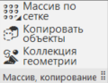
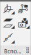
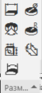

# Панель инструментов

В этом уроке мы рассмотрим ключевые инструменты на панели в программе КОМПАС 3D, предназначенные для работы с деталями. Эти инструменты позволяют вам не только создавать эскизы, но и превращать их в объемные детали, применять размеры, анализировать геометрию и многое другое.

## Эскиз: основа каждой детали

Эскиз является отправной точкой при создании деталей. На панели инструментов вы найдете различные инструменты для рисования и редактирования эскизов. Возможности включают линии, окружности, прямоугольники и многое другое.

## Элементы тела: создание трехмерной формы

Используйте инструменты для создания элементов тела, таких как блоки, цилиндры, конусы и т.д. Эти инструменты позволяют вам превратить ваши эскизы в объемные формы, задавая им нужный объем и структуру.

## Элементы каркаса: придание силы и жесткости

Элементы каркаса - представлены разнообразными компонентами, включая спирали, точки с заданными координатами, контуры и сплайны. Эти инструменты не только обеспечивают внешнюю эстетику вашей детали, но и вносят в нее физическую прочность и структурную целостность.

## Массив и копирование: ускорение процесса

Инструменты массива позволяют вам многократно повторять элементы, экономя время и усилия. Копирование и массивы особенно полезны при создании повторяющихся элементов детали.

## Вспомогательные объекты: точность и прецизионность

Используйте вспомогательные объекты, такие как плоскости, чтобы обеспечить точность в расположении элементов вашей детали. Эти инструменты помогут вам создавать сложные структуры и обеспечивать их правильное расположение.

## Размеры: установка параметров

Используйте инструменты для добавления размеров к вашим элементам. Это не только задает точные размеры детали, но и позволяет легко изменять размеры в процессе проектирования.

## Заключение

Панель инструментов для работы с деталями в КОМПАС 3D предоставляет вам всесторонний инструментарий для создания, редактирования и анализа ваших трехмерных моделей. В следующем уроке мы более подробно рассмотрим команды элементов тела, которые содержатся в этой панели, позволяя вам более глубоко изучить возможности программы.
