# Элементы тела

Добро пожаловать в урок по элементам тела в программе КОМПАС 3D! В этом уроке мы более подробно рассмотрим различные инструменты и техники, предоставляемые программой, для формирования и модификации тел деталей. Давайте погружаться в детали и изучать функционал КОМПАС 3D.

## Основные команды создания детали

| №   | Тип элемента          | Описание                                                                                                                                                                                          | Пример                                |
| --- | --------------------- | ------------------------------------------------------------------------------------------------------------------------------------------------------------------------------------------------- | ------------------------------------- |
| 1   | Элемент выдавливания  | Элемент выдавливания позволяет создавать объемные формы, выдавливая эскиз вдоль определенного направления. Этот инструмент идеально подходит для формирования базовых геометрических форм детали. | 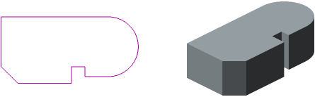  |
| 2   | Элемент вращения      | Элемент вращения используется для создания деталей с круговой симметрией. Вы можете вращать эскиз вокруг выбранной оси, формируя круглые формы с впечатляющей детализацией.                       | 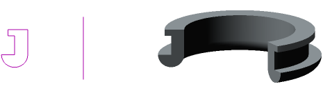      |
| 3   | Элемент по траектории | Создание элементов по траектории позволяет вам следовать за определенной кривой или линией, придавая вашей детали сложные и изогнутые формы, соответствующие заданным критериям.                  | 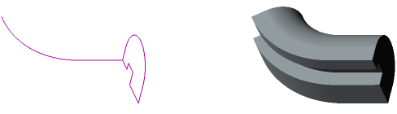 |
| 4   | Элемент по сечениям   | Инструмент по сечениям позволяет создавать тела деталей, используя сечения и профили. Это предоставляет гибкость в формировании сложных геометрических форм и структур.                           | 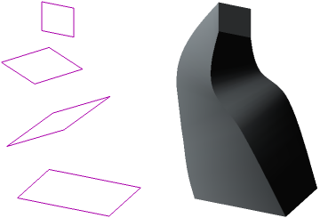  |

## Основные команды редактирования детали

| №   | Тип элемента     | Описание                                                                                                                                                                                    | Пример                            |
| --- | ---------------- | ------------------------------------------------------------------------------------------------------------------------------------------------------------------------------------------- | --------------------------------- |
| 1   | Придание толщины | Придание толщины элементам тела делает их объемными, пригодными для дальнейших операций моделирования и более точного представления детали.                                                 | 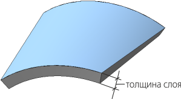 |
| 2   | Ребро жесткости  | Элемент ребра жесткости добавляет каркасные элементы, повышая прочность и структурную целостность детали. Это полезно для создания устойчивых и прочных конструкций.                        | 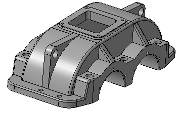  |
| 3   | Сечение          | Элемент сечения позволяет вам создавать формы, используя сечения и профили в различных плоскостях. Это эффективный способ изменения формы детали.                                           | 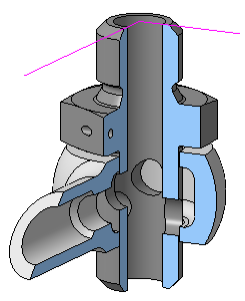          |
| 4   | Оболочка         | Инструмент оболочки покрывает деталь плоским или криволинейным обрамлением, придавая ей дополнительные аэродинамические или эстетические характеристики.                                    |          |
| 5   | Скругление       | Скругление добавляет закругления к углам и кромкам детали, придавая ей более гладкий внешний вид и предотвращая острые углы.                                                                | 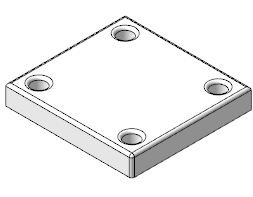       |
| 6   | Фаска            | Инструмент фаски создает скосы на углах детали, улучшая ее внешний вид и функциональность. Это особенно полезно для снижения риска повреждений и улучшения эргономики.                      | 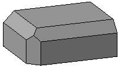            |
| 7   | Уклон            | Элемент уклона придает наклон или наклонение определенным частям вашей детали. Это важно для создания более сложных форм и деталей с измененной геометрией.                                 | 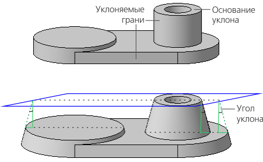            |
| 8   | Булева операция  | Булевы операции (объединение, вычитание, пересечение) позволяют вам комбинировать и модифицировать различные элементы тела. Это существенно для формирования сложных структур и соединений. |   |
| 9   | Разрезать        | Инструмент разрезания дает возможность создавать разрезы и сечения ваших деталей, обеспечивая дополнительные возможности для проектирования и анализа.                                      | 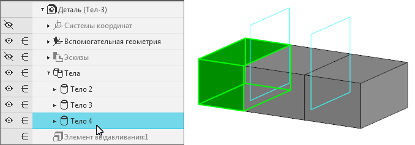        |

## Отверстия

| №   | Тип отверстия                    | Описание                                                                                                                                                                                                     | Пример                                            |
| --- | -------------------------------- | ------------------------------------------------------------------------------------------------------------------------------------------------------------------------------------------------------------ | ------------------------------------------------- |
| 1   | Отверстие простое                | Создание отверстий в детали для крепежных элементов или других целей с помощью простого инструмента отверстия.                                                                                               | 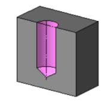                |
| 2   | Отверстие с зенковкой            | Этот элемент позволяет создавать отверстия с зенковкой, что часто используется для скрытого размещения крепежных элементов. Зенковка улучшает внешний вид и обеспечивает более гладкую поверхность.          | 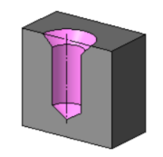            |
| 3   | Отверстие с цековкой             | Используйте этот инструмент для добавления цековки к отверстию, обеспечивая точное позиционирование деталей. Цековка играет ключевую роль в точном соединении и выравнивании элементов.                      | 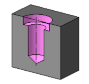             |
| 4   | Отверстие с зенковкой и цековкой | Этот инструмент комбинирует зенковку и цековку, предоставляя более широкие возможности для деталей с отверстиями. Это важно для создания сложных соединений и обеспечения точности в расположении отверстий. | 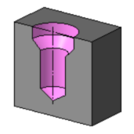 |
| 5   | Отверстие коническое             | Создание конических отверстий для различных целей в вашей детали. Конические отверстия могут быть полезными для создания углублений или обеспечения определенной формы в детали.                             |              |

## Заключение

Эти элементы тела предоставляют вам множество возможностей для творчества в КОМПАС 3D. Погружайтесь в увлекательный мир трехмерного моделирования, и в следующем уроке мы начнем более подробное изучение каждого элемента, начиная с размеров. Готовьтесь к расширению вашего опыта и улучшению навыков в создании и редактировании деталей!
