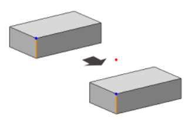
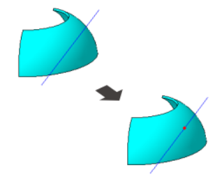
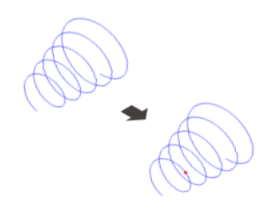
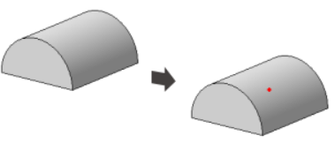
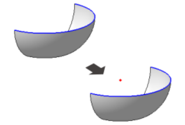
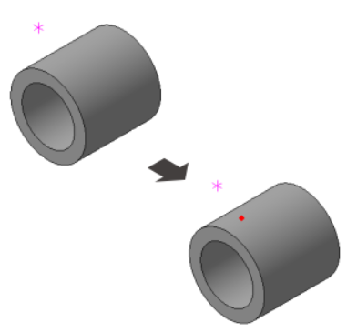
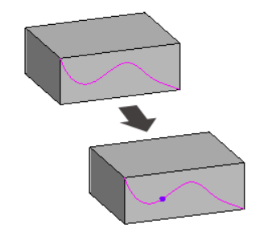
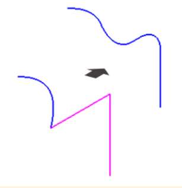
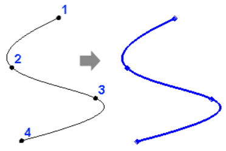
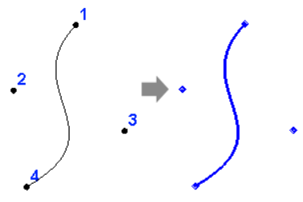

# Элементы каркаса

В этом уроке мы рассмотрим различные элементы каркаса в КОМПАС-3D. Эти инструменты предоставляют широкий спектр возможностей для создания сложных структурных элементов и обеспечивают укрепление деталей.

## Простановка точки

| №   | Тип точки                     | Описание                                                                                                                                                   | Пример                                        |
| --- | ----------------------------- | ---------------------------------------------------------------------------------------------------------------------------------------------------------- | --------------------------------------------- |
| 1   | Точка по координатам          | Начнем с создания точек по заданным координатам. Это удобно, когда необходимо точно определить положение в пространстве.                                   |                                               |
| 2   | Точка переносом               | Используя инструмент "Точка переносом", мы можем создавать точки, перемещая их из одного места в другое. Это полезно для коррекции расположения элементов. |                  |
| 3   | Точка на пересечении объектов | Создание точек на пересечении объектов позволяет нам определить точное местоположение в точках пересечения двух или более элементов.                       |  |
| 4   | Точка на кривой               | Устанавливаем точку на кривой, что особенно важно при создании деталей с изогнутыми формами. Это позволяет точно определить положение вдоль кривой.        |                |
| 5   | Точка на поверхности          | С помощью "Точки на поверхности" мы можем создавать точки привязки к поверхностям объектов, что обеспечивает точное размещение элементов.                  |           |
| 6   | Точка в центре объекта        | Удобный способ размещения точки в центре выбранного объекта, обеспечивая точную центрацию.                                                                 |         |
| 7   | Проекционная точка            | Создание точки проекции позволяет нам определить положение точки относительно выбранной плоскости проекции.                                                |              |
| 8   | Точка между вершинами         | Определяем точку между двумя вершинами, что полезно при равномерном распределении элементов.                                                               |         |

## Контур

Элемент "Контур" предоставляет возможность создавать сложные линии, охватывающие область в пространстве. Он особенно полезен при создании сложных форм и структур.

## Спираль

| №   | Тип спирали            | Описание                                                                                                                                                 |
| --- | ---------------------- | -------------------------------------------------------------------------------------------------------------------------------------------------------- |
| 1   | Спираль цилиндрическая | Спираль цилиндрическая позволяет создавать витки вокруг цилиндрической поверхности. Это может быть важно, например, при создании винтовых элементов.     |
| 2   | Спираль коническая     | Спираль коническая подобна цилиндрической, но с учетом конической формы. Это удобно при создании элементов, расположенных вдоль конических поверхностей. |

## Сплайны

| №   | Тип сплайна       | Описание                                                                                                             | Пример                            |
| --- | ----------------- | -------------------------------------------------------------------------------------------------------------------- | --------------------------------- |
| 1   | Сплайн по точкам  | Сплайн по точкам предоставляет гибкий способ создания плавных кривых, контролируя их форму через определенные точки. |   |
| 2   | Сплайн по полюсам | Сплайн по полюсам позволяет создавать сложные кривые, привязывая полюсы к определенным точкам в пространстве.        |  |

## Заключение

Элементы каркаса предоставляют множество возможностей для создания сложных структур и форм в КОМПАС-3D. Они являются важным инструментом при моделировании деталей с разнообразными формами и геометрией. В следующем уроке мы сфокусируемся на изучении команд массива и копирования в КОМПАС-3D. Эти инструменты играют важную роль в создании повторяющихся элементов и обеспечивают эффективность в процессе моделирования. Давайте рассмотрим, как эти команды могут улучшить ваш опыт в работе с трехмерными моделями, делая их более гибкими и легкими в редактировании.
