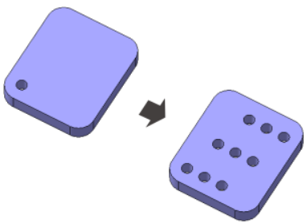
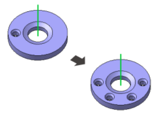
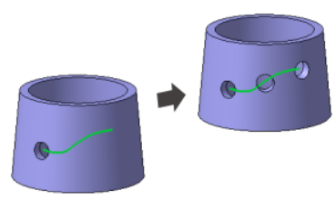
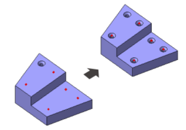
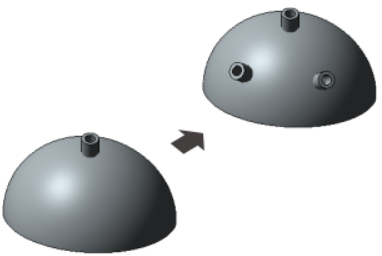
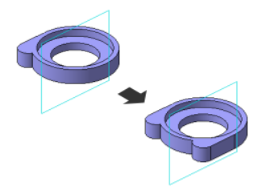
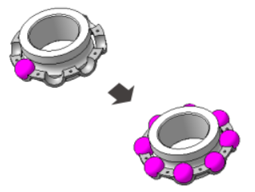

# Массив, копирование

Добро пожаловать в новый этап изучения деталей в КОМПАС 3D! В этом уроке мы углубимся в мир команд массива и копирования, предоставляемых программой. Эти инструменты позволяют эффективно создавать повторяющиеся элементы и улучшают общую гибкость вашего трехмерного моделирования. Давайте рассмотрим различные виды массивов и методы копирования объектов, чтобы раскрыть потенциал этих инструментов для вашего творчества в мире трехмерного моделирования.

## Массив

| №   | Тип массива                     | Описание                                                                                     | Пример                                           |
| --- | ------------------------------- | -------------------------------------------------------------------------------------------- | ------------------------------------------------ |
| 1   | Массив по сетке                 | Создание повторяющегося ряда объектов по горизонтальной и вертикальной сетке.                |                 |
| 2   | Массив по концентрической сетке | Формирование массива элементов вокруг центральной точки с равномерным распределением.        |  |
| 3   | Массив вдоль кривой             | Размещение элементов вдоль выбранной кривой, обеспечивая гибкость в распределении.           |              |
| 4   | Массив по точкам                | Создание массива объектов, выстроенных вдоль выбранных точек.                                |                 |
| 5   | Массив по таблице               | Использование табличных данных для создания массива элементов с заданными параметрами.       |                |
| 6   | Зеркальный массив               | Отражение объектов относительно выбранной плоскости, обеспечивая симметричное распределение. |                |
| 7   | Массив по образцу               | Создание массива объектов, выравненных по выбранному образцу.                                |                |

## Копировать объекты

Метод копирования объектов для повторного использования и быстрого создания идентичных элементов.

## Заключение

С изучением команд массива и методов копирования мы расширяем наши возможности в создании сложных деталей в КОМПАС 3D. Эти инструменты пригодятся в повседневной практике, увеличивая эффективность процесса моделирования и предоставляя новые возможности для творчества. Давайте погружаться в увлекательный мир массивов и копирования!
