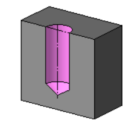
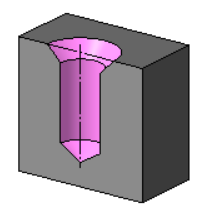
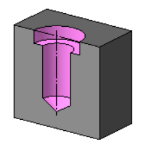
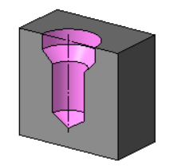
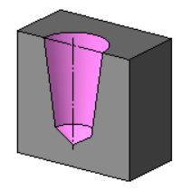

# Урок: Отверстия в 3D-моделировании

В мире трехмерного моделирования отверстия являются важными элементами конструкции деталей. В этом уроке мы рассмотрим различные виды отверстий, их параметры, а также способы размещения в пространстве.

## Виды отверстий

| №   | Тип отверстия                    | Описание                                                                                                                                   | Пример                                            |
| --- | -------------------------------- | ------------------------------------------------------------------------------------------------------------------------------------------ | ------------------------------------------------- |
| 1   | Отверстие простое                | Начнем с базового вида отверстия - простого отверстия без дополнительных элементов.                                                        |                 |
| 2   | Отверстие с зенковкой            | Зенковка придаст вашему отверстию скругленные края, что часто используется для предотвращения повреждения поверхности.                     |             |
| 3   | Отверстие с цековкой             | Цековка, или контрглубок, добавляет выступ вокруг отверстия, что может быть полезным для создания точного взаимодействия.                  |              |
| 4   | Отверстие с зенковкой и цековкой | Комбинация зенковки и цековки сочетает в себе обе функции, обеспечивая безопасность и точное позиционирование.                             |  |
| 5   | Отверстие коническое             | Отверстие с коническим дном может использоваться для создания углубленного или расширенного эффекта в зависимости от потребностей дизайна. |              |

## Дно отверстия

1. **Коническое дно:** Коническое дно придает отверстию форму усеченного конуса, что может быть полезно для определенных технических требований.
2. **Плоское дно:** Плоское дно отверстия обеспечивает прямое, плоское дно без изменения геометрии.
3. **Сферическое дно:** Сферическое дно добавляет округлость к дну отверстия, что может быть важно для определенных дизайнерских решений.

## Глубина отверстия

1. **На расстояние:** Задайте точную глубину отверстия, указывая расстояние от начала координат или другой точки.
2. **Через все:** Определите отверстие, проходящее через всю толщину объекта.
3. **До объекта:** Глубина отверстия ограничивается поверхностью другого объекта.

## Размещение отверстий

1. **По смещениям от 2 объектов:** Укажите смещение отверстия относительно двух других объектов, что обеспечивает точное позиционирование.
2. **По координатам на плоскости:** Разместите отверстие точно на плоскости, указав координаты.
3. **По координатам на цилиндре:** Аналогично, разместите отверстие на цилиндре, задав координаты на его поверхности.
4. **По координатам на сфере:** Разместите отверстие с точностью на сфере, указав соответствующие координаты.
5. **По параметрам U и V:** В случае использования параметров U и V, вы можете точно определить положение отверстия на поверхности объекта.

## Заключение

Отверстия играют важную роль в создании сложных и функциональных деталей. Знание различных видов отверстий и методов их размещения дает вам мощный инструмент для реализации ваших проектных идей в 3D-моделировании. Практикуйтесь, экспериментируйте и создавайте уникальные детали с использованием отверстий.
