# Резьба

Добро пожаловать на урок по моделированию болта с резьбой! В этом уроке мы погрузимся в процесс создания детали, которая часто встречается в мире инженерии и дизайна. Болт с резьбой - это не только функциональная деталь, но и отличный способ освоить различные инструменты трехмерного моделирования.

Мы разберемся с каждым этапом: начиная от создания эскизов для головки и тела болта, заканчивая добавлением деталей, таких как фаска и скругление. Особое внимание уделим моделированию резьбы, следуя стандартам, чтобы создать реалистичный и функциональный элемент.

## Задание

Создайте деталь болта М20.

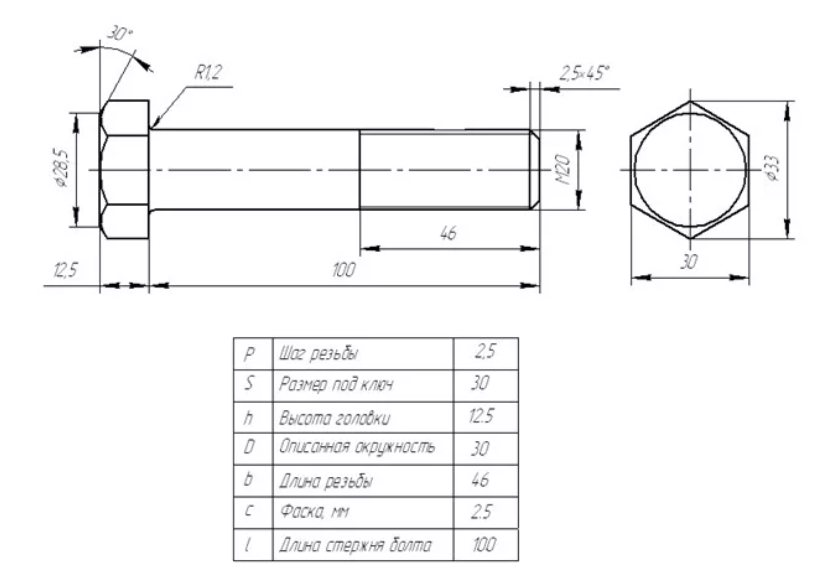

## Решение

### 1. Эскиз головки болта

Начнем с создания эскиза для головки болта, исключая фаску.

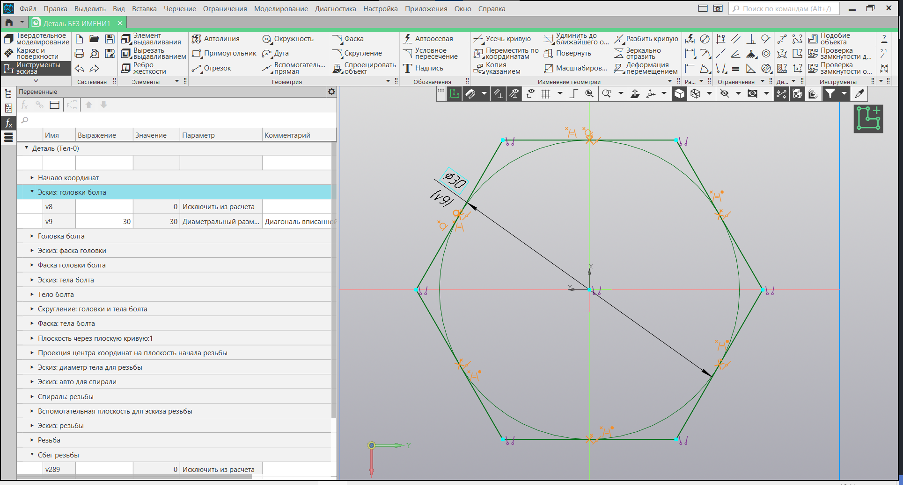

### 2. Выдавливание головки

Используя команду "Элемент выдавливания", создадим форму головки болта.

### 3. Эскиз фаски головки

Создадим эскиз для фаски головки болта.

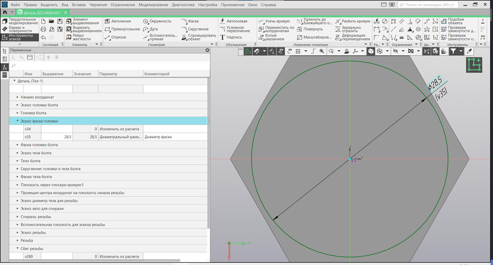

### 4. Создание фаски головки

Применим команду "Фаска", чтобы придать форму головке болта.

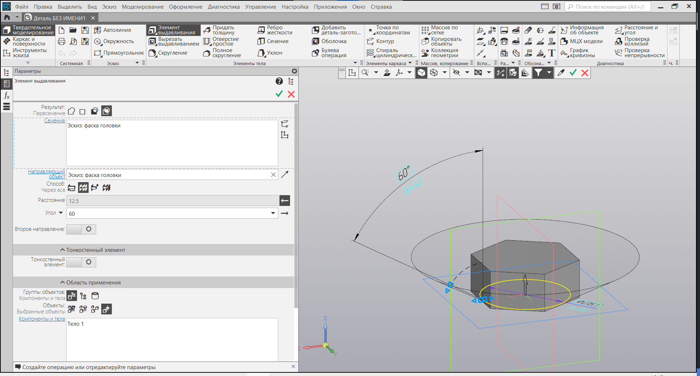

### 5. Эскиз тела болта

Создадим эскиз для тела болта.

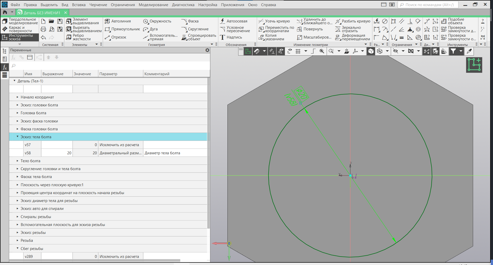

### 6. Выдавливание тела болта

С использованием команды "Элемент выдавливания" создадим тело болта.

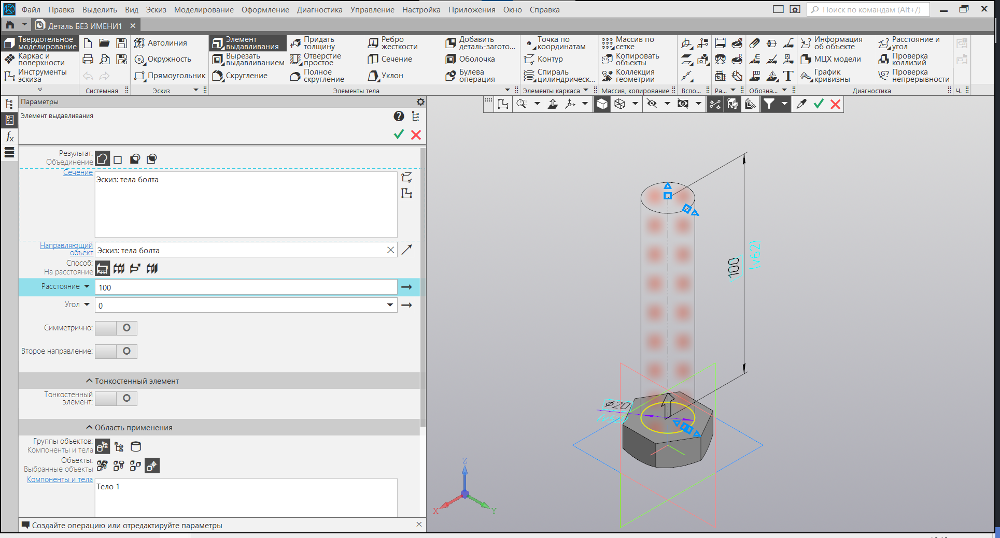

### 7. Скругление и фаска тела болта

Добавим скругление (команда "Скругление") и фаску (команда "Фаска") для тела болта.

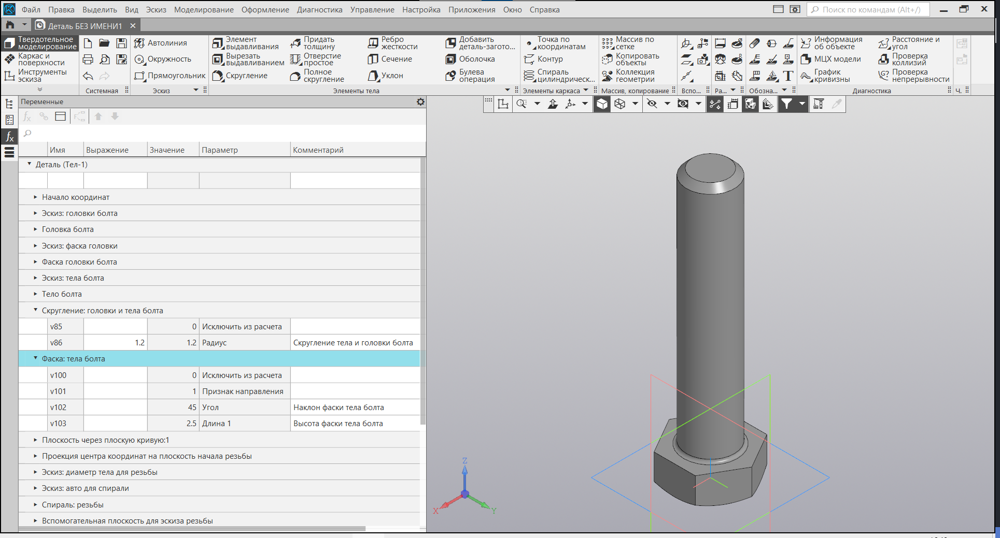

### 8. Создание элементов для спирали резьбы

Построим элементы для создания спирали: плоскость для спирали, проекцию центра координат на плоскость спирали и эскиз окружности с диаметром тела болта.

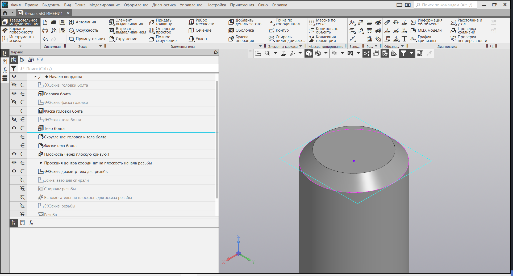

### 9. Создание цилиндрической спирали

Создадим цилиндрическую спираль, задав шаг, длину и привязав ее к проекции центра координат.

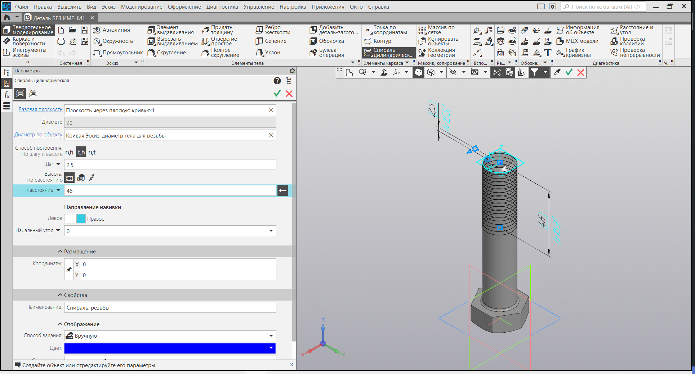

### 10. Построение плоскости для эскиза резьбы

Создадим дополнительную плоскость для эскиза резьбы с помощью команды "Плоскость через три точки" (центр координат, проекция центра координат и начало спирали).

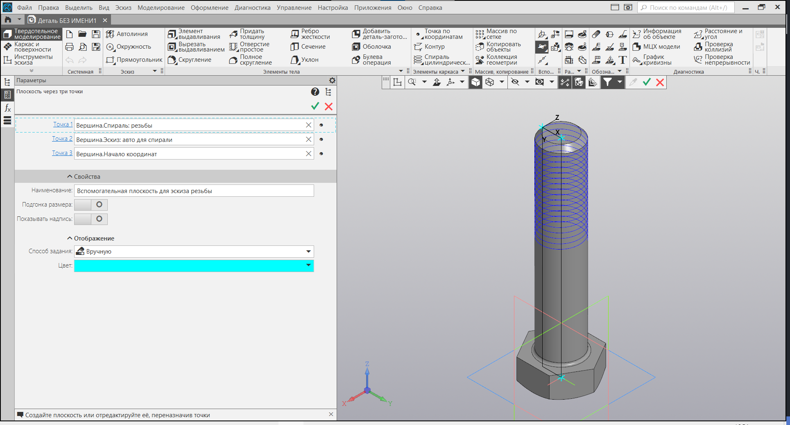

### 11. Эскиз резьбы

Построим эскиз резьбы, следуя стандартам, например, [ГОСТ 24705-2004](https://docs.yandex.ru/docs/view?tm=1700408579&tld=ru&lang=ru&name=gost-24705-2004.pdf&text=гост%20резьба&url=https://ntcexpert.ru/documents/docs/normativs/gost-24705-2004.pdf&lr=10278&mime=pdf&l10n=ru&sign=6942d75f006d4719911ff725f752a328&keyno=0&nosw=1&serpParams=tm%3D1700408579%26tld%3Dru%26lang%3Dru%26name%3Dgost-24705-2004.pdf%26text%3D%25D0%25B3%25D0%25BE%25D1%2581%25D1%2582%2B%25D1%2580%25D0%25B5%25D0%25B7%25D1%8C%25D0%25B1%25D0%25B0%26url%3Dhttps%253A%2F%2Fntcexpert.ru%2Fdocuments%2Fdocs%2Fnormativs%2Fgost-24705-2004.pdf%26lr%3D10278%26mime%3Dpdf%26l10n%3Dru%26sign%3D6942d75f006d4719911ff725f752a328%26keyno%3D0%26nosw%3D1).

### 12. Вырезание по траектории

С использованием команды "Вырезать по траектории" создадим резьбу на теле болта.

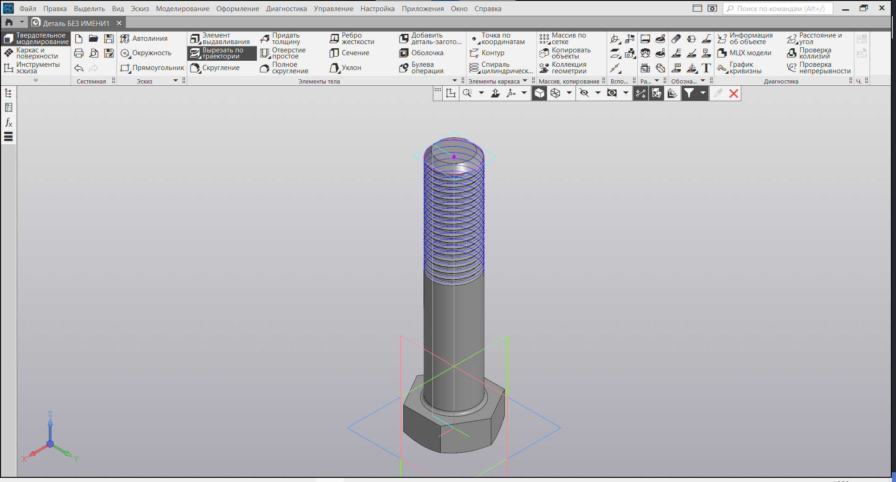

### 13. Штрихи резьбы

Добавим штрихи резьбы, выбрав команду "Вырезать выдавливанием", эскиз и установив способ вырезания "Через все" для начала и конца резьбы.

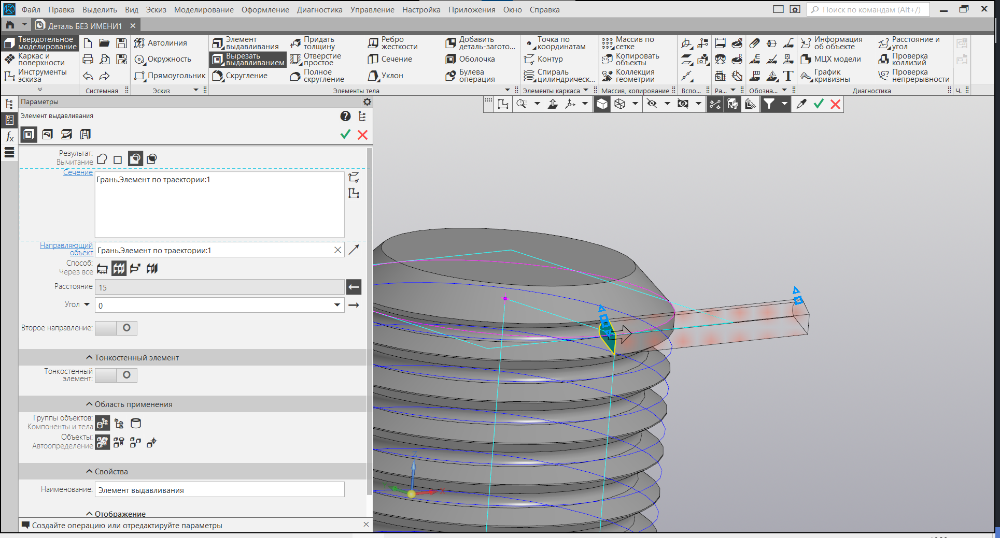

Наслаждайтесь готовым результатом!

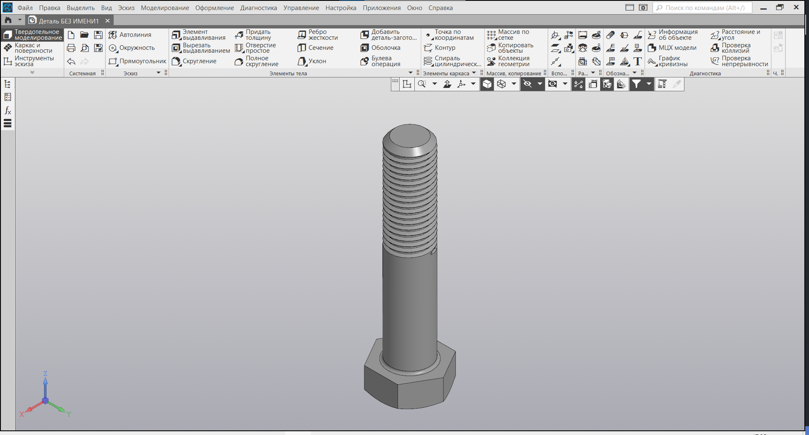

## Заключение

Этот урок предоставил вам понимание того, как создать болт с резьбой, включая различные элементы, такие как головка, тело и даже резьба. Используйте эти навыки для создания разнообразных деталей в мире трехмерного моделирования.
