# Массивы

Добро пожаловать в урок по работе с массивами в программе моделирования! Массивы представляют собой мощный инструмент, позволяющий многократно повторять геометрические элементы и создавать сложные структуры с легкостью. В этом уроке мы рассмотрим несколько видов массивов и узнаем, как использовать их для эффективного построения деталей.

## Массив по сетке

### Задание

Давайте начнем с создания детали, используя массив по сетке.

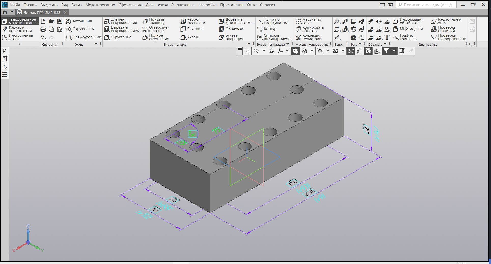

### Решение

1. **Основная форма:**
   Построим основные формы детали, используя инструменты эскиза и выдавливания.

   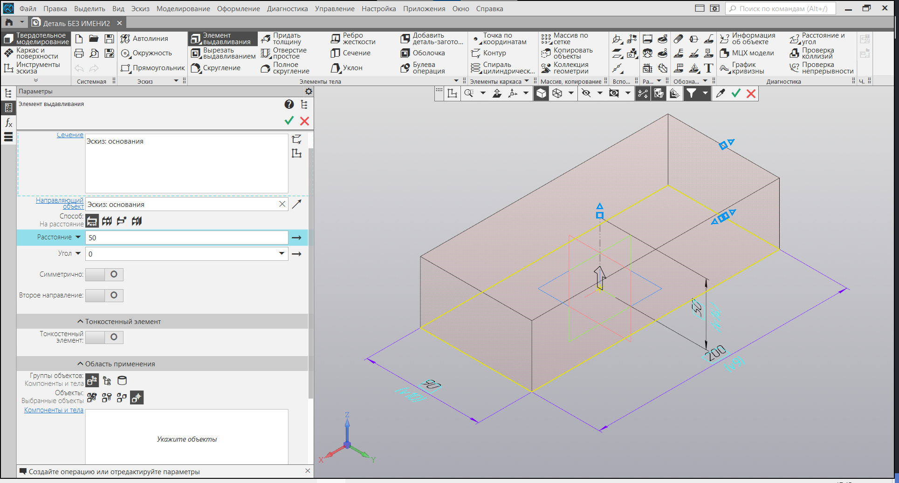

2. **Отверстие:**
   Создадим отверстие с помощью команды "Отверстие простое", указав, что оно должно быть сквозным и расположено относительно центра координат.

   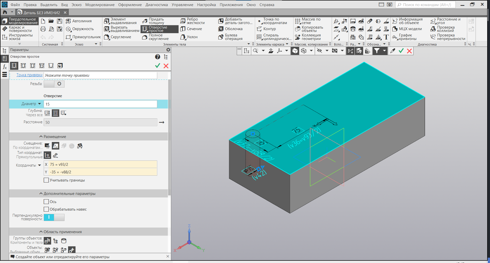

3. **Массив по сетке:**
   Сделаем массив отверстий, выбрав опцию "Массив по сетке".

   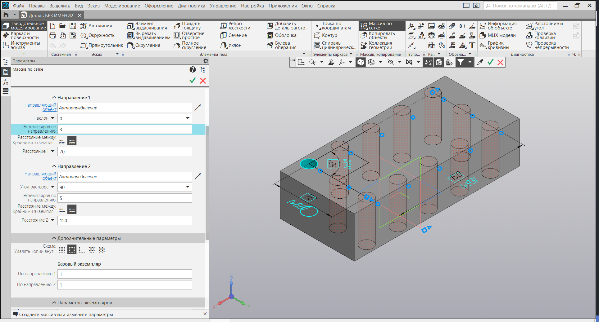

4. **Расположение с помощью формул:**
   С использованием формул уточним расположение копируемого отверстия.

   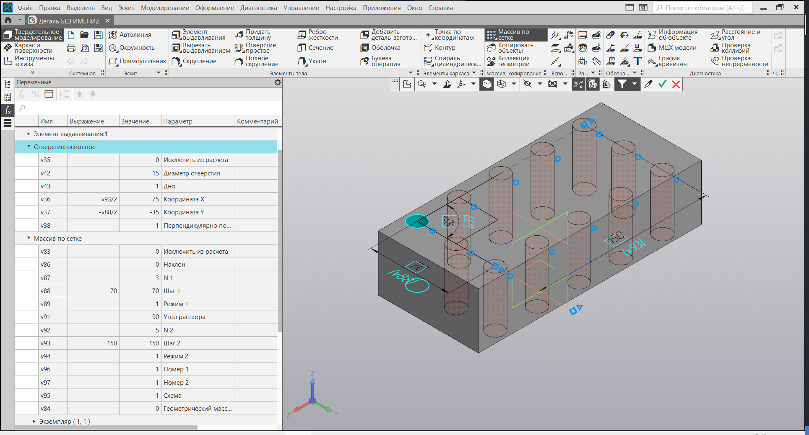

## Массив по концентрической сетке

### Задание

Переходим к созданию детали с использованием массива по концентрической сетке.

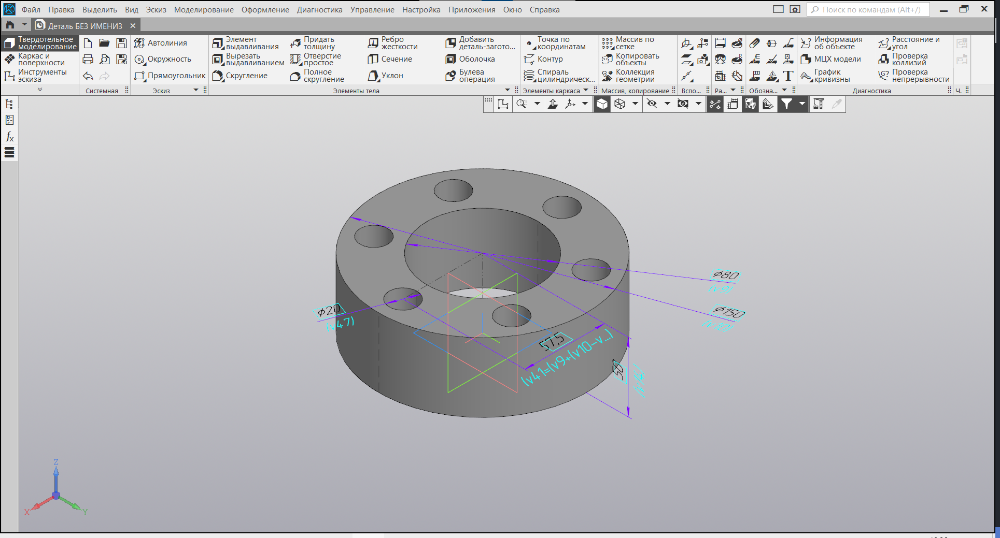

### Решение

1. **Основная форма:**
   Сначала построим основные формы создаваемой детали.

   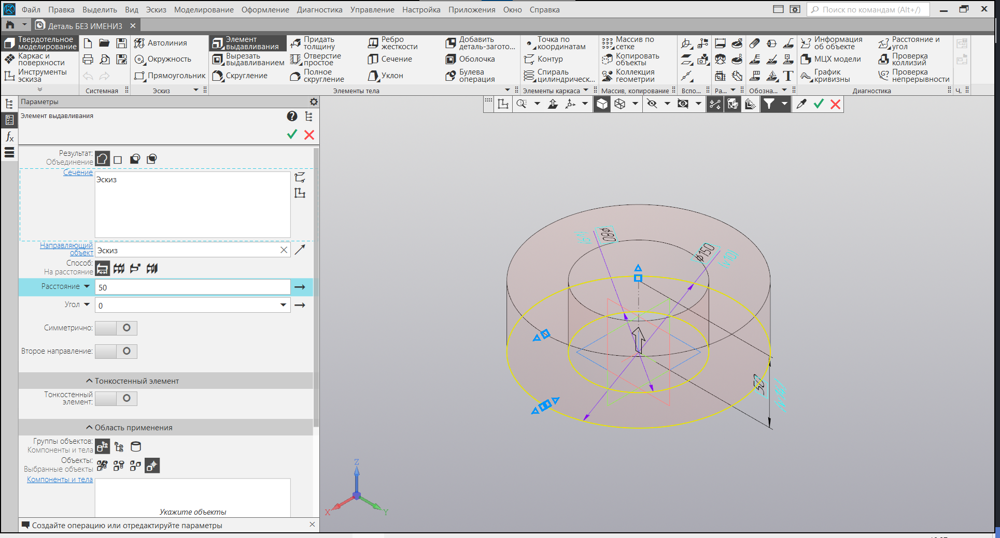

2. **Отверстие:**
   Добавим отверстие, опять же, используя команду "Отверстие простое".

   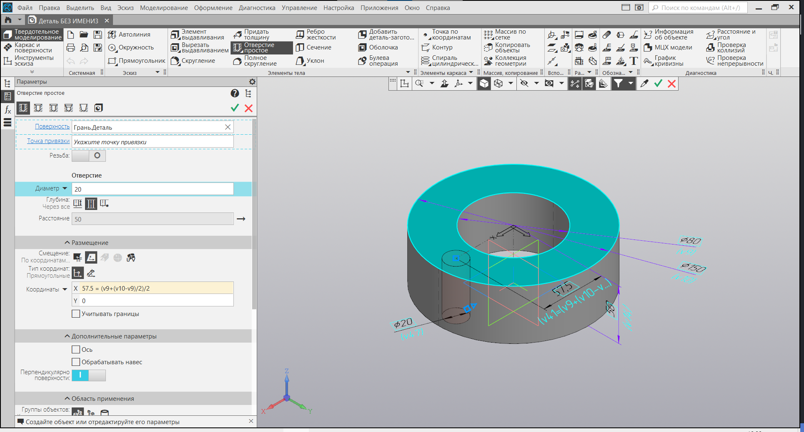

3. **Массив по концентрической сетке:**
   Сделаем копии отверстия по концентрической сетке.

   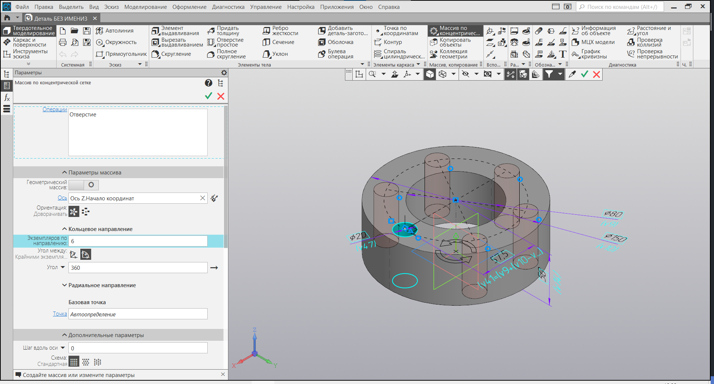

4. **Расположение с помощью формул:**
   Уточним расположение копируемого отверстия, применяя формулы.

   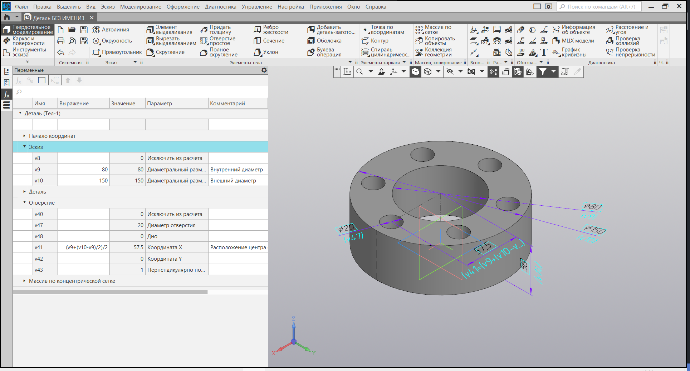

## Массив вдоль кривой

### Задание

Теперь перейдем к построению детали с использованием массива вдоль кривой.

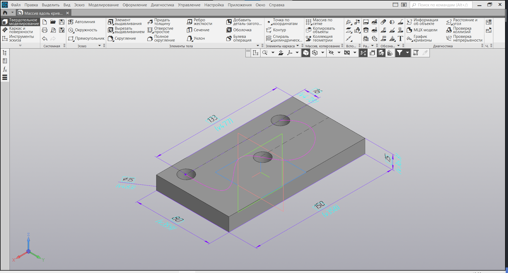

### Решение

1. **Основная форма:**
   Построим основные формы детали, а также создадим эскиз кривой.

   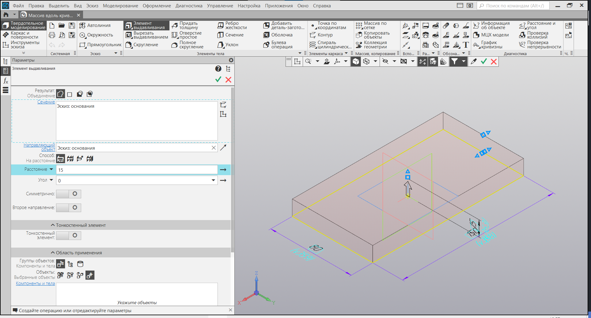

2. **Сквозное отверстие:**
   Сформируем сквозное отверстие, используя кривую.

   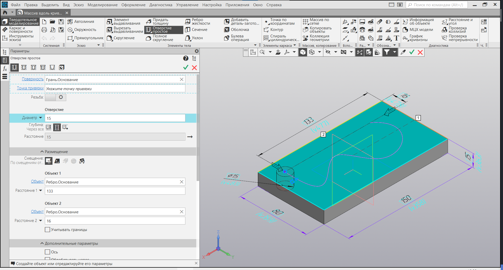

3. **Массив вдоль кривой:**
   Произведем копирование массива отверстий вдоль заданной кривой с помощью команды "Массив вдоль кривой".

   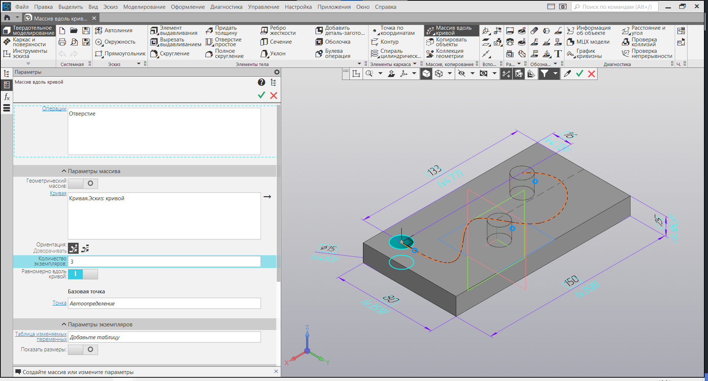

## Заключение

Массивы предоставляют удивительные возможности для создания сложных структур. Мы рассмотрели массивы по сетке, концентрической сетке и вдоль кривой, а также увидели, как использовать формулы для точного позиционирования элементов. Практикуйтесь в их применении, и вы сможете с легкостью моделировать разнообразные детали в мире трехмерного диз
